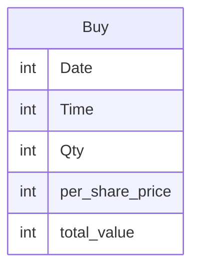

# Documentation for Table: dbo.Buy

## Overview
The `dbo.Buy` table appears to store information related to purchase transactions, likely for a financial or inventory management system. Each record in this table represents a specific purchase event, capturing details such as the date and time of the transaction, the quantity of items purchased, the price per share, and the total value of the transaction. This table is essential for tracking buying activities and analyzing purchasing trends over time.

## Columns

| Name               | Type | Nullable | Default | Description                                   |
|--------------------|------|----------|---------|-----------------------------------------------|
| Date               | int  | Yes      | None    | The date of the purchase transaction.         |
| Time               | int  | Yes      | None    | The time of the purchase transaction.         |
| Qty                | int  | Yes      | None    | The quantity of items purchased.              |
| per_share_price    | int  | Yes      | None    | The price per share of the purchased item.   |
| total_value        | int  | Yes      | None    | The total value of the purchase transaction.  |

## Keys & Relationships
- **Primary Keys**: None defined.
- **Foreign Keys**: None defined.

## Indexes
- **Indexes**: None defined.  
  Without indexes, queries may perform slower, especially as the volume of data grows. It is advisable to consider indexing columns frequently used in WHERE clauses or JOIN operations.

## Sample Data

| Date | Time | Qty | per_share_price | total_value |
|------|------|-----|------------------|-------------|
| 15   | 10   | 10  | 10               | 100         |
| 15   | 14   | 20  | 10               | 200         |

## Data Volume
The `dbo.Buy` table currently contains **2 rows**. This low volume suggests that the table may be in the early stages of data collection or that it is used for a specific, limited purpose. As the volume increases, performance considerations and data management strategies will need to be addressed.

## Data Quality Red Flags
- **Nullable Columns**: All columns are nullable, which may lead to incomplete records if not managed properly.
- **Lack of Primary Key**: The absence of a primary key could result in duplicate records and makes it difficult to uniquely identify each transaction.
- **Data Types**: The use of `int` for date and time may not be ideal, as it could lead to confusion regarding the format and representation of these values. Consider using appropriate date/time data types for clarity and accuracy.