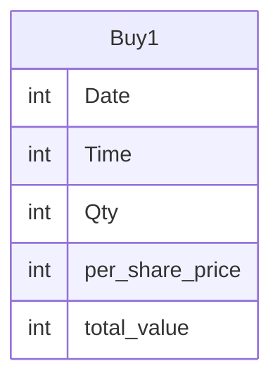

# Documentation for Table: dbo.Buy1

## Overview
The `dbo.Buy1` table appears to store transactional data related to purchases, likely in a financial or trading context. Each record represents a specific buying event, capturing details such as the date and time of the transaction, the quantity of items purchased, the price per share, and the total value of the transaction. This table may be used for tracking purchases over time, analyzing buying patterns, or generating reports related to sales performance.

## Columns

| Name               | Type | Nullable | Default | Description                          |
|--------------------|------|----------|---------|--------------------------------------|
| Date               | int  | Yes      | None    | The date of the purchase transaction. |
| Time               | int  | Yes      | None    | The time of the purchase transaction. |
| Qty                | int  | Yes      | None    | The quantity of items purchased.      |
| per_share_price    | int  | Yes      | None    | The price per share at the time of purchase. |
| total_value        | int  | Yes      | None    | The total value of the transaction.   |

## Keys & Relationships
- **Primary Keys**: None defined.
- **Foreign Keys**: None defined.

## Indexes
- **No indexes defined**: This may impact query performance, especially for searches or aggregations on the columns.

## Sample Data

| Date | Time | Qty | per_share_price | total_value |
|------|------|-----|------------------|-------------|
| 15   | 10   | 10  | 10               | 100         |
| 15   | 14   | 20  | 10               | 200         |

## Data Volume
The `dbo.Buy1` table currently contains **2 rows**. This low volume may limit the ability to perform meaningful analysis or trend identification. As the dataset grows, it will be important to consider indexing strategies to optimize query performance.

## Data Quality Red Flags
- **Nullable Columns**: All columns are nullable, which may lead to incomplete records if not properly managed.
- **Lack of Primary Key**: The absence of a primary key could result in duplicate records, making data integrity a concern.
- **Data Types**: The use of `int` for date and time may not be ideal, as it could lead to confusion regarding the format (e.g., Unix timestamp vs. human-readable format). 

Overall, while the table serves a clear purpose, there are several areas for improvement in terms of data integrity and quality.