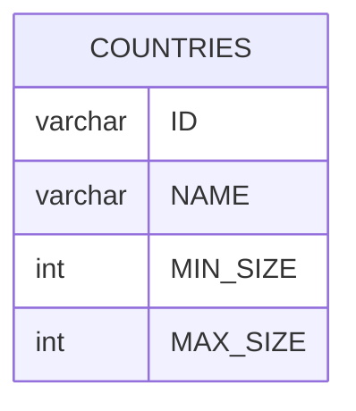

# Documentation for Table: dbo.COUNTRIES

## Overview
The `dbo.COUNTRIES` table is designed to store information about various countries. The inferred business purpose of this table is to maintain a catalog of countries along with their respective size constraints, which could be relevant for applications that require geographical data, such as mapping services, travel applications, or demographic analysis. The size constraints (MIN_SIZE and MAX_SIZE) may represent some form of classification or categorization based on the area or population of the countries.

## Columns

| Name       | Type    | Nullable | Default | Description                          |
|------------|---------|----------|---------|--------------------------------------|
| ID         | varchar | Yes      | NULL    | Unique identifier for each country. |
| NAME       | varchar | Yes      | NULL    | Name of the country.                 |
| MIN_SIZE   | int     | Yes      | NULL    | Minimum size classification of the country. |
| MAX_SIZE   | int     | Yes      | NULL    | Maximum size classification of the country. |

## Keys & Relationships
- **Primary Keys**: None defined.
- **Foreign Keys**: None defined.

## Indexes
- **No indexes defined**: This may impact query performance, especially for lookups or joins involving the `COUNTRIES` table.

## Sample Data

| ID                                   | NAME           | MIN_SIZE | MAX_SIZE |
|--------------------------------------|----------------|----------|----------|
| 023fd23615bd4ff4b2ae0a13ed7efec9    | Bolivia        | 2        | 4        |
| be247f73de0f4b2d810367cb26941fb9    | Cook Islands    | 4        | 8        |
| 3e85ab80a6f84ef3b9068b21dbcc54b3    | Brazil         | 4        | 7        |

## Data Volume
The `dbo.COUNTRIES` table currently contains approximately **6 rows**. This volume is relatively small, which may not pose significant performance issues for queries. However, as the dataset grows, considerations for indexing and optimization will become increasingly important.

## Data Quality Red Flags
- **Nullable Columns**: All columns in the table are nullable, which may lead to incomplete records if not managed properly.
- **Lack of Primary Key**: The absence of a primary key could lead to duplicate entries and data integrity issues.
- **Unknown Constraints**: The purpose of MIN_SIZE and MAX_SIZE is unclear without additional context, which could lead to inconsistent data entry practices.

Overall, while the table serves a clear purpose, improvements in data integrity and quality management are recommended.