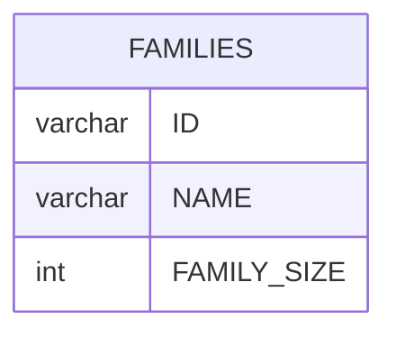

# Documentation for Table: dbo.FAMILIES

## Overview
The `dbo.FAMILIES` table is designed to store information about families, likely for a system that manages family-related data, such as demographics, social services, or community programs. Each record represents a family, identified by a unique ID, and includes the family's name and size. This information can be useful for analysis related to family structures, resource allocation, and community outreach.

## Columns

| Name          | Type    | Nullable | Default | Description                     |
|---------------|---------|----------|---------|---------------------------------|
| ID            | varchar | Yes      | None    | Unique identifier for the family (likely a UUID). |
| NAME          | varchar | Yes      | None    | Name of the family.            |
| FAMILY_SIZE   | int     | Yes      | None    | Number of members in the family.|

## Keys & Relationships
- **Primary Keys**: None defined.
- **Foreign Keys**: None defined.

## Indexes
- No indexes are defined for the `dbo.FAMILIES` table. Adding indexes on the `ID` or `NAME` columns could improve query performance for lookups based on these fields.

## Sample Data

| ID                                   | NAME          | FAMILY_SIZE |
|--------------------------------------|---------------|-------------|
| c00dac11bde74750b4d207b9c182a85f    | Alex Thomas   | 9           |
| eb6f2d3426694667ae3e79d6274114a4    | Chris Gray    | 2           |
| 3f7b5b8e835d4e1c8b3e12e964a741f3    | Emily Johnson  | 4           |

## Data Volume
The `dbo.FAMILIES` table currently contains approximately **5 rows**. This volume is relatively small, which may imply that the table is either newly created, underutilized, or part of a larger dataset that is not fully populated yet.

## Data Quality Red Flags
- **Primary Key Absence**: The table does not have a defined primary key, which could lead to duplicate records and data integrity issues.
- **Nullable Fields**: All columns are nullable, which raises concerns about data completeness and quality. It is advisable to enforce constraints to ensure that critical fields (like `ID` and `NAME`) are populated.
- **Lack of Indexes**: The absence of indexes may lead to performance issues as the dataset grows, especially for queries that filter or sort based on `ID` or `NAME`.