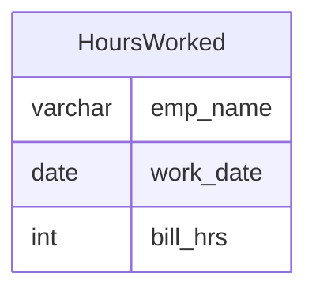

# Documentation for Table: dbo.HoursWorked

## Overview
The `dbo.HoursWorked` table is designed to track the hours worked by employees on specific dates. This table likely serves a business purpose related to payroll, project management, or performance tracking, allowing organizations to monitor employee productivity and billable hours.

## Columns

| Name       | Type    | Nullable | Default | Description                          |
|------------|---------|----------|---------|--------------------------------------|
| emp_name   | varchar | Yes      | NULL    | The name of the employee.            |
| work_date  | date    | Yes      | NULL    | The date on which the hours were worked. |
| bill_hrs   | int     | Yes      | NULL    | The number of billable hours worked on the specified date. |

## Keys & Relationships
- **Primary Keys**: None defined.
- **Foreign Keys**: None defined.

## Indexes
- **No indexes defined**: This may impact query performance, especially for searches or aggregations on `emp_name`, `work_date`, or `bill_hrs`.

## Sample Data

| emp_name | work_date  | bill_hrs |
|----------|------------|----------|
| Sachin   | 1990-07-01 | 3        |
| Sachin   | 1990-08-01 | 5        |
| Sehwag   | 1990-07-01 | 2        |

## Data Volume
The `dbo.HoursWorked` table currently contains approximately **4 rows**. This low volume may indicate that the table is either newly created, underutilized, or that data entry processes are not fully operational.

## Data Quality Red Flags
- **No Primary Key**: The absence of a primary key may lead to duplicate entries and data integrity issues.
- **Nullable Columns**: All columns are nullable, which could result in incomplete records if not managed properly.
- **Low Row Count**: The limited number of records may suggest that the table is not being actively populated or utilized.

Overall, while the `dbo.HoursWorked` table has a clear purpose, it requires further development in terms of data integrity and volume to be fully effective in its intended business role.