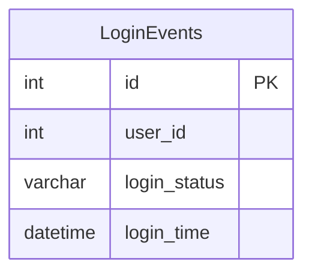

# Documentation for Table: dbo.LoginEvents

## Overview
The `LoginEvents` table is designed to track user login attempts within an application. It captures essential information about each login event, including the user attempting to log in, the status of the login attempt (success or failure), and the timestamp of the event. This table is likely used for monitoring user activity, security auditing, and troubleshooting login issues.

## Columns

| Name            | Type       | Nullable | Default | Description                               |
|-----------------|------------|----------|---------|-------------------------------------------|
| id (PK)        | int        | No       | None    | Unique identifier for each login event.  |
| user_id         | int        | Yes      | None    | Identifier for the user attempting to log in. |
| login_status     | varchar(10)| Yes      | None    | Status of the login attempt (e.g., success, fail). |
| login_time       | datetime   | Yes      | None    | Timestamp of when the login attempt occurred. |

## Keys & Relationships
- **Primary Key**: 
  - `id`
  
- **Foreign Keys**: 
  - None

## Indexes
- **PK__LoginEve__3213E83F6F216362**
  - **Columns**: `id`
  - **Type**: CLUSTERED
  - **Usage**: This index ensures that each login event has a unique identifier, which supports efficient retrieval of login events by their ID.

## Sample Data

| id | user_id | login_status | login_time           |
|----|---------|--------------|-----------------------|
| 1  | 100     | fail         | 2024-07-01 10:00:00   |
| 2  | 100     | fail         | 2024-07-01 10:02:00   |
| 3  | 100     | success      | 2024-07-01 10:04:00   |

## Data Volume
The `LoginEvents` table currently contains approximately **11 rows**. This volume suggests that the table is likely being used in a relatively low-traffic environment or that it is a new feature being rolled out. As the application scales, monitoring the growth of this table will be important for performance and storage considerations.

## Data Quality Red Flags
- The `user_id` column is nullable, which may lead to records without an associated user. This could complicate user tracking and analysis.
- The `login_status` column is also nullable, which could result in ambiguous records if the status is not provided.
- The sample data shows multiple failed login attempts followed by a successful attempt for the same user, which may indicate a potential security concern or user behavior pattern that should be monitored.