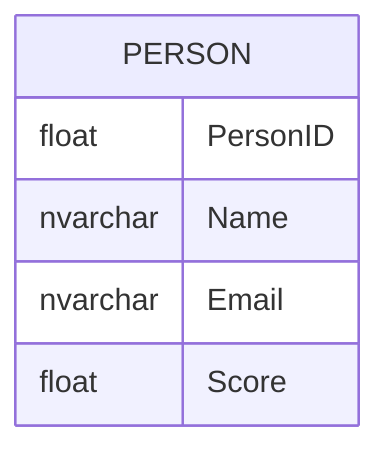

# Documentation for Table: dbo.Person$

## Overview
The `dbo.Person$` table appears to store information about individuals, likely for a system that tracks personal data and associated scores. The presence of fields such as `Name`, `Email`, and `Score` suggests that this table may be used in contexts such as user management, performance tracking, or customer relationship management. The use of a dollar sign in the table name is unusual and may indicate that this table is part of a legacy system or a specific application context.

## Columns

| Name        | Type       | Nullable | Default | Description                       |
|-------------|------------|----------|---------|-----------------------------------|
| PersonID   | float      | Yes      | NULL    | Unique identifier for each person (PK) |
| Name       | nvarchar   | Yes      | NULL    | Full name of the person           |
| Email      | nvarchar   | Yes      | NULL    | Email address of the person       |
| Score      | float      | Yes      | NULL    | Score associated with the person   |

## Keys & Relationships
- **Primary Keys**: None defined.
- **Foreign Keys**: None defined.

## Indexes
- **No indexes defined**: This may lead to performance issues when querying the table, especially as the volume of data grows.

## Sample Data

| PersonID | Name  | Email                     | Score |
|----------|-------|---------------------------|-------|
| 1.0      | Alice | alice2018@hotmail.com     | 88.0  |
| 2.0      | Bob   | bob2018@hotmail.com       | 11.0  |
| 3.0      | Davis | davis2018@hotmail.com     | 27.0  |

## Data Volume
The table currently contains approximately **5 rows**. This low volume suggests that performance is not currently an issue, but as the data grows, the lack of primary keys and indexes may lead to slower query performance.

## Data Quality Red Flags
- **Primary Key Missing**: The absence of a primary key may lead to duplicate entries and data integrity issues.
- **Nullable Columns**: All columns are nullable, which could result in incomplete records if not managed properly.
- **Data Type for PersonID**: Using `float` for `PersonID` is unusual; typically, integers or GUIDs are preferred for identifiers to avoid precision issues.
- **Lack of Indexes**: The absence of indexes may hinder query performance as the dataset grows. 

Overall, the table structure suggests a need for improvement in data integrity and performance optimization.