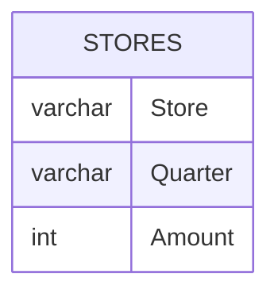

# Documentation for Table: dbo.STORES

## Overview
The `dbo.STORES` table appears to be designed to track financial or sales data for various stores over different quarters. Each record likely represents the amount of revenue or sales generated by a specific store during a specific quarter. This information can be useful for analyzing store performance, budgeting, and forecasting.

## Columns

| Name      | Type    | Nullable | Default | Description                              |
|-----------|---------|----------|---------|------------------------------------------|
| Store     | varchar | Yes      | NULL    | Identifier for the store (e.g., 'S1')   |
| Quarter   | varchar | Yes      | NULL    | Quarter of the year (e.g., 'Q1', 'Q2')  |
| Amount    | int     | Yes      | NULL    | Amount of revenue or sales for the store |

## Keys & Relationships
- **Primary Keys**: None defined.
- **Foreign Keys**: None defined.

## Indexes
- **No indexes defined**: This may impact query performance, especially for searches or aggregations on the `Store` or `Quarter` columns.

## Sample Data

| Store | Quarter | Amount |
|-------|---------|--------|
| S1    | Q1      | 200    |
| S1    | Q2      | 300    |
| S1    | Q4      | 400    |

## Data Volume
The `dbo.STORES` table contains approximately **9 rows**. This volume is relatively small, which may allow for quick queries and analysis but could also indicate limited data for comprehensive trend analysis.

## Data Quality Red Flags
- **Lack of Primary Key**: The absence of a primary key may lead to duplicate records and data integrity issues.
- **Nullable Columns**: All columns are nullable, which raises concerns about data completeness. If many records have null values, it could hinder analysis.
- **No Foreign Keys**: The lack of foreign key constraints suggests that there may be no enforced relationships with other tables, which could lead to orphaned records or inconsistencies in the data.

Overall, while the `dbo.STORES` table serves a clear purpose, there are several areas for improvement in terms of data integrity and quality.