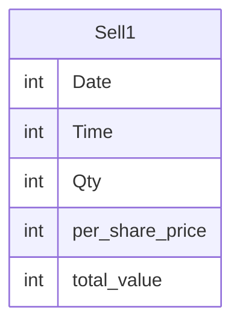

# Documentation for Table: dbo.Sell1

## Overview
The `dbo.Sell1` table appears to be designed for tracking sales transactions, likely in a financial or trading context. The columns suggest that it records the date and time of sales, the quantity of items sold, the price per share, and the total value of the transaction. This table could be used for reporting sales performance, analyzing trends over time, or managing inventory.

## Columns

| Name               | Type | Nullable | Default | Description                          |
|--------------------|------|----------|---------|--------------------------------------|
| Date               | int  | Yes      | None    | The date of the sale (likely in a numeric format) |
| Time               | int  | Yes      | None    | The time of the sale (likely in a numeric format) |
| Qty                | int  | Yes      | None    | The quantity of items sold           |
| per_share_price    | int  | Yes      | None    | The price per share of the sold items |
| total_value        | int  | Yes      | None    | The total value of the transaction    |

## Keys & Relationships
- **Primary Keys**: None defined.
- **Foreign Keys**: None defined.

## Indexes
- **No indexes defined**: This may impact query performance, especially for searches or aggregations on the columns.

## Sample Data

| Date | Time | Qty | per_share_price | total_value |
|------|------|-----|------------------|-------------|
| 15   | 13   | 8   | 20               | 240         |
| 15   | 15   | 12  | 20               | 160         |
| 15   | 16   | 5   | 20               | 160         |

## Data Volume
The `dbo.Sell1` table currently contains **3 rows**. This low volume suggests that it may be in the early stages of data collection or that it is used for a specific time period. As the volume increases, performance considerations for querying and reporting will need to be addressed.

## Data Quality Red Flags
- **Nullable Columns**: All columns are nullable, which could lead to incomplete records if not managed properly.
- **Lack of Primary Key**: The absence of a primary key may lead to duplicate records or difficulty in uniquely identifying transactions.
- **Data Type for Date and Time**: Using `int` for date and time may lead to confusion regarding the format and could complicate date/time operations.
- **Inconsistent Data**: The sample data shows varying quantities and total values, but without a primary key, it is unclear if these records are unique or if duplicates exist. 

Overall, while the table serves a clear purpose, improvements in structure and data integrity measures are recommended.