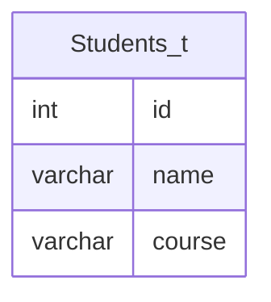

# Documentation for Table: dbo.Students_t

## Overview
The `dbo.Students_t` table is designed to store information about students, including their unique identifiers, names, and the courses they are enrolled in. The inferred business purpose of this table is to manage student records within an educational institution, allowing for tracking of student enrollment in various courses.

## Columns

| Name       | Type      | Nullable | Default | Description                          |
|------------|-----------|----------|---------|--------------------------------------|
| id         | int       | Yes      | None    | Unique identifier for each student. |
| name       | varchar   | Yes      | None    | Name of the student.                 |
| course     | varchar   | Yes      | None    | Course the student is enrolled in.   |

## Keys & Relationships
- **Primary Keys**: None defined.
- **Foreign Keys**: None defined.

## Indexes
- **No indexes defined**: This may lead to performance issues when querying the table, especially as the volume of data increases.

## Sample Data

| id | name    | course |
|----|---------|--------|
| 1  | Arul    | SQL    |
| 1  | Arul    | Spark  |
| 2  | Bhumica | SQL    |

## Data Volume
The `dbo.Students_t` table currently contains approximately **4 rows**. This volume is relatively small, which may not pose immediate performance concerns. However, as the number of records grows, the lack of indexes could lead to slower query performance.

## Data Quality Red Flags
- **Duplicate IDs**: The sample data shows that the same `id` (1) is associated with multiple courses for the same student (Arul). This could indicate a design flaw or a need for normalization.
- **Nullable Columns**: All columns are nullable, which may lead to incomplete records if not managed properly.
- **No Primary Key**: The absence of a primary key could lead to data integrity issues, such as duplicate entries for the same student.