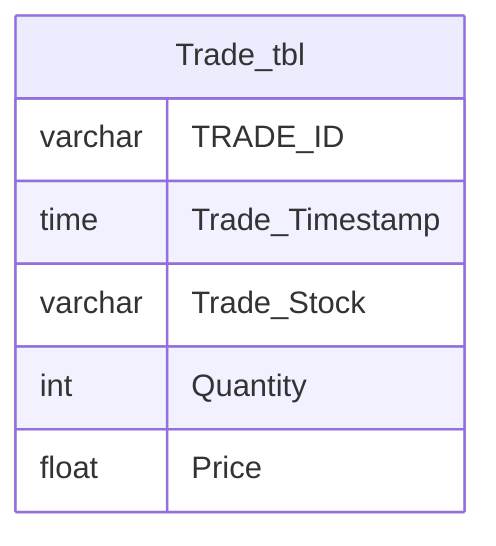

# Trade_tbl Documentation

## Overview
The `Trade_tbl` table is designed to store information about trades executed in a trading system. Each record represents a specific trade, capturing details such as the trade ID, timestamp, stock involved, quantity traded, and the price at which the trade was executed. This table is likely used for tracking trading activities, analyzing trading patterns, and generating reports related to stock trades.

## Columns

| Name               | Type    | Nullable | Default | Description                          |
|--------------------|---------|----------|---------|--------------------------------------|
| TRADE_ID           | varchar | Yes      | None    | Unique identifier for each trade.   |
| Trade_Timestamp     | time    | Yes      | None    | The time when the trade was executed.|
| Trade_Stock        | varchar | Yes      | None    | The stock associated with the trade. |
| Quantity           | int     | Yes      | None    | The number of shares traded.        |
| Price              | float   | Yes      | None    | The price per share at which the trade occurred. |

## Keys & Relationships
- **Primary Keys**: None defined.
- **Foreign Keys**: None defined.

## Indexes
- **No indexes defined**: This may impact query performance, especially for searches or aggregations on columns like `Trade_Stock` or `Trade_Timestamp`.

## Sample Data

| TRADE_ID | Trade_Timestamp | Trade_Stock      | Quantity | Price |
|----------|-----------------|------------------|----------|-------|
| TRADE1  | 10:01:05        | ITJunction4All   | 100      | 20.0  |
| TRADE2  | 10:01:06        | ITJunction4All   | 20       | 15.0  |
| TRADE3  | 10:01:08        | ITJunction4All   | 150      | 30.0  |

## Data Volume
The `Trade_tbl` currently contains approximately **6 rows**. This low volume may indicate that the table is either newly created or that trades are infrequent. As the volume increases, performance considerations such as indexing and partitioning may become necessary.

## Data Quality Red Flags
- **Nullable Columns**: All columns are nullable, which may lead to incomplete records if not managed properly.
- **Lack of Primary Key**: The absence of a primary key could result in duplicate records, making data integrity a concern.
- **No Foreign Keys**: Without foreign keys, there is no enforced relationship with other tables, which may lead to orphaned records or inconsistent data.

Overall, while the `Trade_tbl` serves a clear purpose in tracking trades, improvements in data integrity and quality management practices are recommended.