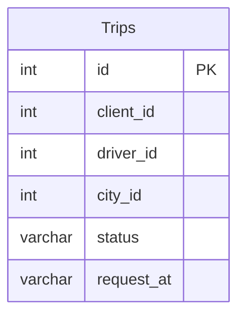

# Documentation for Table: dbo.Trips

## Overview
The `dbo.Trips` table is designed to store information about trips taken by clients, including details about the client, driver, city, status of the trip, and the time the request was made. This table likely serves a transportation or ride-sharing business, where tracking trips is essential for operational management, reporting, and analytics.

## Columns

| Name         | Type    | Nullable | Default | Description                          |
|--------------|---------|----------|---------|--------------------------------------|
| id           | int     | Yes      | None    | Unique identifier for each trip (PK)|
| client_id    | int     | Yes      | None    | Identifier for the client requesting the trip |
| driver_id    | int     | Yes      | None    | Identifier for the driver assigned to the trip |
| city_id      | int     | Yes      | None    | Identifier for the city where the trip takes place |
| status       | varchar | Yes      | None    | Current status of the trip (e.g., completed, cancelled) |
| request_at   | varchar | Yes      | None    | Timestamp of when the trip was requested |

## Keys & Relationships
- **Primary Keys**: None defined.
- **Foreign Keys**: None defined.

## Indexes
No indexes are defined for the `dbo.Trips` table. Adding indexes on columns such as `client_id`, `driver_id`, and `status` could improve query performance for filtering trips by these attributes.

## Sample Data

| id | client_id | driver_id | city_id | status                | request_at |
|----|-----------|-----------|---------|-----------------------|------------|
| 1  | 1         | 10        | 1       | completed             | 2013-10-01 |
| 2  | 2         | 11        | 1       | cancelled_by_driver   | 2013-10-01 |
| 3  | 3         | 12        | 6       | completed             | 2013-10-01 |

## Data Volume
The `dbo.Trips` table currently contains approximately **10 rows**. This volume suggests that the table may be in the early stages of data accumulation or that it is part of a larger dataset where trips are logged over time.

## Data Quality Red Flags
- **Primary Key Absence**: The absence of a defined primary key may lead to issues with data integrity and uniqueness of trip records.
- **Nullable Columns**: All columns are nullable, which could result in incomplete records if not managed properly.
- **Data Type for `request_at`**: The `request_at` column is defined as `varchar`, which is not ideal for storing date/time values. This could lead to inconsistencies in date formats and difficulties in date-based queries. 

Overall, while the table serves a clear purpose, there are several areas for improvement in terms of data integrity and quality.