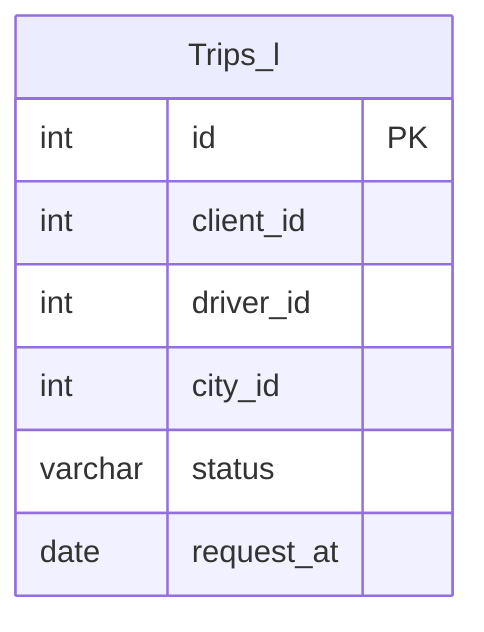

# Documentation for Table: dbo.Trips_l

## Overview
The `dbo.Trips_l` table appears to store information about trips taken by clients with drivers in a specific city. The inferred business purpose of this table is to track the details of each trip, including the client and driver involved, the status of the trip, and the date the trip was requested. This data can be useful for analyzing trip patterns, driver performance, and client behavior.

## Columns

| Name          | Type        | Nullable | Default | Description                          |
|---------------|-------------|----------|---------|--------------------------------------|
| id            | int         | Yes      | None    | Unique identifier for each trip (PK)|
| client_id     | int         | Yes      | None    | Identifier for the client            |
| driver_id     | int         | Yes      | None    | Identifier for the driver            |
| city_id       | int         | Yes      | None    | Identifier for the city              |
| status        | varchar(30) | Yes      | None    | Current status of the trip           |
| request_at    | date        | Yes      | None    | Date when the trip was requested     |

## Keys & Relationships
- **Primary Keys**: None defined.
- **Foreign Keys**: None defined.

## Indexes
No indexes are defined for the `dbo.Trips_l` table. Adding indexes on columns such as `client_id`, `driver_id`, or `status` could improve query performance for filtering trips based on these attributes.

## Sample Data

| id | client_id | driver_id | city_id | status                | request_at |
|----|-----------|-----------|---------|-----------------------|------------|
| 1  | 1         | 4         | 1       | completed             | 2013-10-01 |
| 2  | 1         | 6         | 1       | cancelled_by_driver    | 2013-10-01 |
| 3  | 3         | 4         | 1       | completed             | 2013-10-02 |

## Data Volume
The `dbo.Trips_l` table currently contains approximately **6 rows**. This low volume may indicate that the table is either newly created or that trips are not being logged frequently. As the volume increases, performance considerations and data management strategies may need to be revisited.

## Data Quality Red Flags
- **Primary Key Absence**: The table does not have a defined primary key, which could lead to duplicate entries and data integrity issues.
- **Nullable Columns**: All columns are nullable, which may lead to incomplete records if not managed properly.
- **Lack of Foreign Keys**: There are no foreign keys defined, which could result in orphaned records if related tables exist for clients, drivers, or cities.
- **Status Values**: The `status` column contains a variety of statuses, but without constraints, it may lead to inconsistent data entry. 

Overall, while the table serves a clear purpose, there are several areas for improvement in terms of data integrity and quality management.