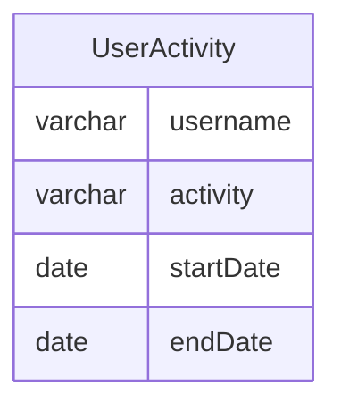

# Documentation for `dbo.UserActivity` Table

## Overview
The `dbo.UserActivity` table is designed to track user activities over time. Each record captures a specific activity performed by a user, along with the start and end dates of that activity. This table likely serves the purpose of analyzing user engagement and behavior patterns, which can be useful for reporting, user experience improvements, and targeted marketing strategies.

## Columns

| Name        | Type      | Nullable | Default | Description                           |
|-------------|-----------|----------|---------|---------------------------------------|
| username    | varchar(20) | Yes      | None    | The name of the user performing the activity. |
| activity    | varchar(20) | Yes      | None    | The type of activity the user engaged in. |
| startDate   | date      | Yes      | None    | The date when the activity started.  |
| endDate     | date      | Yes      | None    | The date when the activity ended.    |

## Keys & Relationships
- **Primary Keys**: None defined.
- **Foreign Keys**: None defined.

## Indexes
- **No indexes defined**: This may lead to performance issues when querying large datasets, especially if filtering or sorting by `username` or `activity`.

## Sample Data

| username | activity | startDate  | endDate    |
|----------|----------|------------|------------|
| Alice    | Travel   | 2020-02-12 | 2020-02-20 |
| Alice    | Dancing   | 2020-02-21 | 2020-02-23 |
| Alice    | Travel   | 2020-02-24 | 2020-02-28 |

## Data Volume
The `UserActivity` table currently contains **4 rows**. This is a relatively small volume of data, which may not pose immediate performance concerns. However, as the number of records grows, the lack of indexes could lead to slower query performance.

## Data Quality Red Flags
- **No Primary Key**: The absence of a primary key may lead to duplicate records, making it difficult to uniquely identify user activities.
- **Nullable Columns**: All columns are nullable, which could result in incomplete records if not managed properly.
- **Lack of Foreign Keys**: Without foreign keys, there is no enforced relationship with other tables, which may lead to data integrity issues.