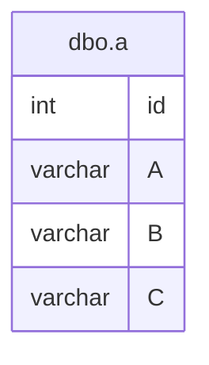

# Documentation for Table: dbo.a

## Overview
The `dbo.a` table appears to be a general-purpose table that may be used to store a collection of records characterized by three string attributes (A, B, C) and an integer identifier (id). The business purpose of this table is likely to manage a set of related data points, although the specific context is unclear due to the generic naming of the columns. The nullable nature of all columns suggests flexibility in data entry, allowing for incomplete records.

## Columns

| Name | Type | Nullable | Default | Description |
|------|------|----------|---------|-------------|
| id | int | Yes | NULL | An identifier for the record, likely intended to be a primary key but currently not defined as such. |
| A | varchar(5) | Yes | NULL | A string attribute that may represent a category or type. |
| B | varchar(5) | Yes | NULL | Another string attribute, possibly related to A or representing a different category. |
| C | varchar(5) | Yes | NULL | A third string attribute, likely serving a similar purpose as A and B. |

## Keys & Relationships
- **Primary Keys**: None defined.
- **Foreign Keys**: None defined.

## Indexes
No indexes are defined for this table. As a result, queries that filter or sort based on any of the columns (id, A, B, C) may experience performance issues, especially as the data volume grows.

## Sample Data

| id | A   | B   | C   |
|----|-----|-----|-----|
| 1  | aa  | bb  | cc  |
| 2  | NULL| kk  | ll  |
| 2  | NULL| bb  | ll  |

## Data Volume
The table currently contains approximately 5 rows. This low volume suggests that performance issues are not a concern at this time. However, as the data grows, the lack of primary keys and indexes may lead to inefficiencies in data retrieval and manipulation.

## Data Quality Red Flags
- The `id` column is not defined as a primary key, which could lead to duplicate entries (as seen in the sample data).
- The presence of NULL values in all columns indicates that data may be incomplete or inconsistently entered.
- The same `id` value (2) appears multiple times with different values for columns B and C, which raises concerns about data integrity and uniqueness.