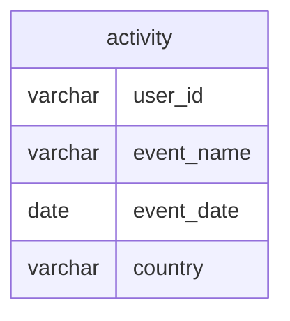

# Documentation for Table: dbo.activity

## Overview
The `dbo.activity` table is designed to track user activities within an application. Each record represents an event associated with a user, such as app installations or purchases. The inferred business purpose is to analyze user engagement and behavior over time, which can help in understanding user retention, app performance, and marketing effectiveness.

## Columns

| Name        | Type    | Nullable | Default | Description                          |
|-------------|---------|----------|---------|--------------------------------------|
| user_id    | varchar | Yes      | None    | Identifier for the user associated with the activity. |
| event_name  | varchar | Yes      | None    | Name of the event (e.g., app-installed, app-purchase). |
| event_date  | date    | Yes      | None    | Date when the event occurred.       |
| country     | varchar | Yes      | None    | Country where the user is located.  |

## Keys & Relationships
- **Primary Keys**: None defined.
- **Foreign Keys**: None defined.

## Indexes
- **No indexes defined**: This may lead to performance issues when querying large datasets, especially if filtering or sorting by any of the columns.

## Sample Data

| user_id | event_name     | event_date | country |
|---------|----------------|-------------|---------|
| 1       | app-installed   | 2022-01-01  | India   |
| 1       | app-purchase    | 2022-01-02  | India   |
| 2       | app-installed   | 2022-01-01  | USA     |

## Data Volume
The `dbo.activity` table currently contains approximately **11 rows**. This volume is relatively small, which may not pose immediate performance concerns. However, as the application scales and user activity increases, monitoring and optimizing the table will be essential.

## Data Quality Red Flags
- **Nullable Columns**: All columns are nullable, which may lead to incomplete records if not managed properly.
- **Lack of Primary Key**: The absence of a primary key could result in duplicate entries for the same user and event, leading to data integrity issues.
- **No Foreign Keys**: Without foreign key constraints, there is no enforcement of relationships with other tables, which could lead to orphaned records or inconsistent data.

Overall, while the `dbo.activity` table serves a clear purpose, it requires careful management to ensure data quality and integrity as the application grows.