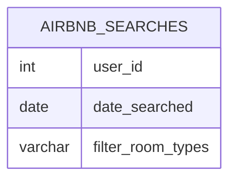

# Documentation for Table: dbo.airbnb_searches

## Overview
The `dbo.airbnb_searches` table is designed to capture search queries made by users on an Airbnb-like platform. It likely serves the purpose of tracking user behavior and preferences when searching for accommodations. This data can be utilized for analytics, such as understanding popular room types, user engagement, and trends over time.

## Columns

| Name                  | Type       | Nullable | Default | Description                                      |
|-----------------------|------------|----------|---------|--------------------------------------------------|
| user_id               | int        | Yes      | NULL    | Identifier for the user making the search.      |
| date_searched         | date       | Yes      | NULL    | The date when the search was performed.          |
| filter_room_types     | varchar(200)| Yes     | NULL    | The types of rooms the user is filtering for.    |

## Keys & Relationships
- **Primary Keys**: None defined.
- **Foreign Keys**: None defined.

## Indexes
- **No indexes defined**: This may impact query performance, especially for searches based on `user_id` or `date_searched`. Adding indexes on these columns could improve lookup times for analytics queries.

## Sample Data

| user_id | date_searched | filter_room_types               |
|---------|---------------|---------------------------------|
| 1       | 2022-01-01    | entire home,private room        |
| 2       | 2022-01-02    | entire home,shared room         |
| 3       | 2022-01-02    | private room,shared room        |

## Data Volume
The `dbo.airbnb_searches` table currently contains approximately **4 rows**. This low volume may limit the insights that can be drawn from the data. As user activity increases, the table will likely grow, necessitating efficient indexing and data management strategies.

## Data Quality Red Flags
- **Nullable Columns**: All columns are nullable, which may lead to incomplete records if not properly managed.
- **Lack of Primary Key**: The absence of a primary key could result in duplicate entries, making data integrity a concern.
- **No Foreign Keys**: Without foreign keys, there is no enforced relationship with other tables, which may lead to orphaned records or inconsistencies in user data.

Overall, while the table serves a clear purpose, improvements in structure and data integrity measures are recommended to enhance its utility and reliability.