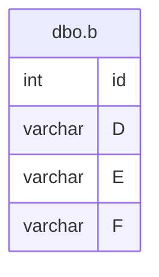

# Documentation for Table: dbo.b

## Overview
The `dbo.b` table appears to be a data repository for a collection of records characterized by a unique identifier and three additional attributes labeled `D`, `E`, and `F`. The inferred business purpose of this table could be to store various categorical or descriptive data points related to a specific entity or process, although the exact nature of these attributes is unclear based on the naming conventions alone. The absence of a primary key suggests that the table may not enforce uniqueness, which could lead to duplicate records.

## Columns

| Name | Type   | Nullable | Default | Description |
|------|--------|----------|---------|-------------|
| id   | int    | Yes      | None    | Unique identifier for the record (PK) |
| D    | varchar(5) | Yes  | None    | Attribute D, purpose unknown |
| E    | varchar(5) | Yes  | None    | Attribute E, purpose unknown |
| F    | varchar(5) | Yes  | None    | Attribute F, purpose unknown |

## Keys & Relationships
- **Primary Keys**: None defined.
- **Foreign Keys**: None defined.

## Indexes
No indexes are defined for the `dbo.b` table. This may lead to performance issues when querying the table, especially as the data volume grows. Queries that filter or sort by any of the columns may benefit from the creation of appropriate indexes.

## Sample Data

| id | D  | E  | F  |
|----|----|----|----|
| 1  | df | bb | mm |
| 2  | mm | ss | ww |
| 3  | mm | ss | ww |

## Data Volume
The `dbo.b` table currently contains approximately 6 rows. This volume is relatively small, which may not pose immediate performance concerns. However, as the data grows, the lack of primary keys and indexes could lead to inefficiencies in data retrieval and management.

## Data Quality Red Flags
- **Primary Key Absence**: The absence of a primary key may lead to duplicate records, which can compromise data integrity.
- **Nullable Columns**: All columns are nullable, which raises concerns about the completeness of the data. If these attributes are essential for business processes, their potential absence could lead to incomplete records.
- **Inconsistent Data**: The sample data shows repeated values for attributes `D`, `E`, and `F`, which may indicate redundancy or a lack of diversity in the data being captured. This could suggest that the table is not being utilized effectively or that the data entry process needs review.