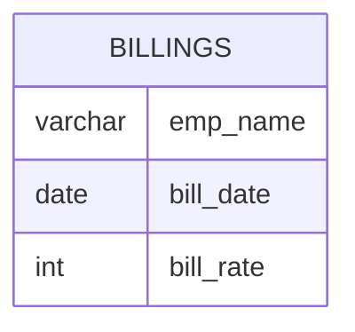

# Documentation for Table: dbo.billings

## Overview
The `dbo.billings` table appears to store billing information related to employees. Each record likely represents a billing entry for a specific employee, including the date of the billing and the rate charged for their services. This table is essential for tracking billing history and managing financial records related to employee services.

## Columns

| Name       | Type    | Nullable | Default | Description                          |
|------------|---------|----------|---------|--------------------------------------|
| emp_name   | varchar | Yes      | NULL    | Name of the employee being billed.  |
| bill_date  | date    | Yes      | NULL    | Date when the billing occurred.     |
| bill_rate  | int     | Yes      | NULL    | Rate charged for the employee's services. |

## Keys & Relationships
- **Primary Keys**: None defined.
- **Foreign Keys**: None defined.

## Indexes
- **No indexes defined**: This may lead to performance issues when querying the table, especially as the volume of data grows.

## Sample Data

| emp_name | bill_date  | bill_rate |
|----------|------------|-----------|
| Sachin   | 1990-01-01 | 25        |
| Sehwag   | 1989-01-01 | 15        |
| Dhoni    | 1989-01-01 | 20        |

## Data Volume
The `dbo.billings` table currently contains approximately **4 rows**. This low volume suggests that the table may be in the early stages of data collection or that it is not frequently updated. As the volume increases, performance considerations such as indexing will become more critical.

## Data Quality Red Flags
- **Nullable Columns**: All columns are nullable, which may lead to incomplete records if not managed properly.
- **Lack of Primary Key**: The absence of a primary key could result in duplicate records and makes it difficult to uniquely identify each billing entry.
- **Short varchar Length**: The `emp_name` column has a maximum length of 10 characters, which may be insufficient for some employee names, leading to potential data truncation.
- **Date Format**: The `bill_date` column is nullable and could lead to records without a billing date, complicating billing history tracking.