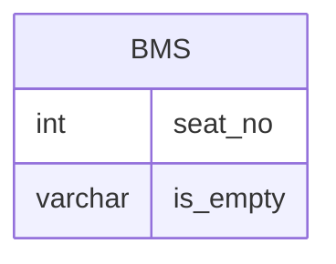

# Documentation for Table: dbo.bms

## Overview
The `dbo.bms` table appears to be related to a seating management system, likely used in contexts such as transportation (e.g., buses, trains) or event venues (e.g., theaters, stadiums). The table tracks individual seats and their occupancy status, indicated by the `is_empty` column. This information can be crucial for managing reservations, ticket sales, and overall capacity planning.

## Columns

| Name       | Type    | Nullable | Default | Description                      |
|------------|---------|----------|---------|----------------------------------|
| seat_no    | int     | Yes      | None    | The seat number (identifier)     |
| is_empty   | varchar | Yes      | None    | Indicates if the seat is empty ('Y' for Yes, 'N' for No) |

## Keys & Relationships
- **Primary Keys**: None defined.
- **Foreign Keys**: None defined.

## Indexes
- **No indexes defined**. This may affect query performance, especially for searches based on `seat_no` or `is_empty`.

## Sample Data

| seat_no | is_empty |
|---------|----------|
| 1       | N        |
| 2       | Y        |
| 3       | N        |

## Data Volume
The `dbo.bms` table contains approximately **14 rows**. This volume suggests that the table is likely part of a larger system, as a seating management system typically would have more entries, especially in high-traffic environments.

## Data Quality Red Flags
- **Primary Key Missing**: The absence of a primary key could lead to duplicate entries for the same seat number, which would compromise data integrity.
- **Nullable Columns**: Both columns are nullable, which may lead to incomplete records if not managed properly.
- **Lack of Indexes**: The absence of indexes may hinder performance for queries that filter or sort by `seat_no` or `is_empty`. 

Overall, while the table serves a clear purpose, improvements in data integrity and performance could be made by defining a primary key and adding appropriate indexes.