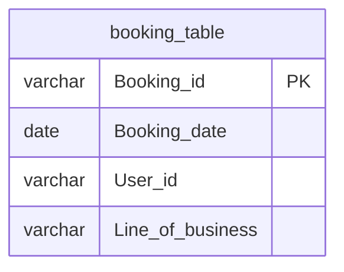

# Documentation for `dbo.booking_table`

## Overview
The `dbo.booking_table` is designed to store information about bookings made by users across different lines of business, such as flights and hotels. Each record represents a unique booking, capturing essential details like the booking ID, date, user ID, and the specific line of business associated with the booking. This table likely supports business operations related to tracking and managing customer bookings.

## Columns

| Name                | Type    | Nullable | Default | Description                          |
|---------------------|---------|----------|---------|--------------------------------------|
| Booking_id (PK)    | varchar | No       | None    | Unique identifier for each booking.  |
| Booking_date        | date    | No       | None    | The date when the booking was made.  |
| User_id             | varchar | No       | None    | Identifier for the user making the booking. |
| Line_of_business     | varchar | No       | None    | The category of the booking (e.g., Flight, Hotel). |

## Keys & Relationships
- **Primary Keys**: 
  - `Booking_id` (PK)
  
- **Foreign Keys**: 
  - None defined.

## Indexes
- No indexes are defined for this table. Adding indexes on `Booking_date` or `User_id` could improve query performance for searches and reports based on these fields.

## Sample Data

| Booking_id | Booking_date | User_id | Line_of_business |
|------------|--------------|---------|------------------|
| b1         | 2022-03-23   | u1      | Flight           |
| b2         | 2022-03-27   | u2      | Flight           |
| b3         | 2022-03-28   | u1      | Hotel            |

## Data Volume
The `dbo.booking_table` contains approximately **20 rows**. This volume suggests that the table is relatively small, which may facilitate quick queries and data retrieval. However, as the business grows, monitoring the volume and performance will be essential.

## Data Quality Red Flags
- **Primary Key**: The `Booking_id` column is marked as a primary key, but it is not explicitly defined in the schema. This could lead to potential issues with data integrity if duplicates are allowed.
- **Column Lengths**: The maximum lengths for `Booking_id`, `User_id`, and `Line_of_business` are relatively short, which may limit the ability to store diverse identifiers or categories.
- **Nullable Columns**: All columns are marked as non-nullable, which is good for data integrity, but it may lead to issues if any data is missing during the booking process.
- **Default Values**: There are no default values set for any columns, which may lead to errors if data is not provided during insertion.