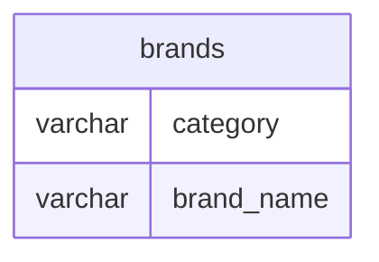

# Documentation for Table: dbo.brands

## Overview
The `dbo.brands` table is designed to store information about various brands, likely within a retail or product management context. Each entry in the table represents a brand, potentially categorized by product type (e.g., chocolates, snacks). The inferred business purpose is to maintain a list of brands that can be referenced in other parts of the application, such as product listings or inventory management.

## Columns

| Name        | Type      | Nullable | Default | Description                          |
|-------------|-----------|----------|---------|--------------------------------------|
| category    | varchar   | Yes      | NULL    | The category of the brand (e.g., chocolates). |
| brand_name  | varchar   | Yes      | NULL    | The name of the brand.              |

## Keys & Relationships
- **Primary Keys**: None defined for this table.
- **Foreign Keys**: None defined for this table.

## Indexes
- **No indexes** are defined for this table. This may impact query performance when searching for specific brands or categories.

## Sample Data

| category   | brand_name  |
|------------|-------------|
| chocolates | 5-star      |
| NULL       | dairy milk   |
| NULL       | perk        |

## Data Volume
The `dbo.brands` table currently contains approximately **7 rows**. This volume is relatively small, which may not pose significant performance issues. However, as the dataset grows, it may be necessary to implement indexing strategies to maintain query performance.

## Data Quality Red Flags
- The `category` column has **NULL** values, indicating that not all brands are categorized. This could lead to inconsistencies in data reporting or analysis.
- There are no primary keys defined, which may lead to duplicate entries or difficulty in uniquely identifying brands.
- The lack of indexes may hinder performance for queries that filter or search by `brand_name` or `category`.