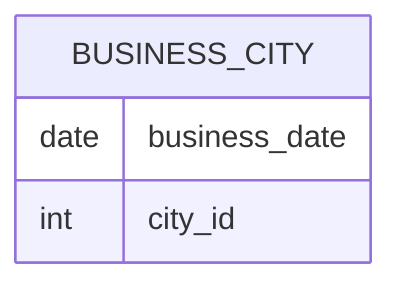

# Documentation for Table: dbo.business_city

## Overview
The `dbo.business_city` table appears to store information related to business activities in various cities, with a focus on specific dates. The inferred business purpose of this table is to track business events or transactions that occur in different cities over time. This could be useful for analyzing trends, performance, or activities in specific locations.

## Columns

| Name          | Type  | Nullable | Default | Description                          |
|---------------|-------|----------|---------|--------------------------------------|
| business_date | date  | Yes      | None    | The date of the business event.      |
| city_id       | int   | Yes      | None    | Identifier for the city associated with the business event. |

## Keys & Relationships
- **Primary Keys**: None defined.
- **Foreign Keys**: None defined.

## Indexes
No indexes are defined for the `dbo.business_city` table. As a result, queries may not be optimized for performance, especially if the table grows in size.

## Sample Data

| business_date | city_id |
|---------------|---------|
| 2020-01-02    | 3       |
| 2020-07-01    | 7       |
| 2021-01-01    | 3       |

## Data Volume
The `dbo.business_city` table currently contains approximately 7 rows. This low volume suggests that the table may be in the early stages of data collection or that business activities are infrequent. As the volume increases, considerations for indexing and performance optimization will become more critical.

## Data Quality Red Flags
- **Nullable Columns**: Both columns (`business_date` and `city_id`) are nullable, which may lead to incomplete records if not managed properly.
- **Lack of Primary Key**: The absence of a primary key could lead to duplicate entries, making data integrity a concern.
- **No Foreign Keys**: Without foreign keys, there is no enforced relationship with other tables, which may lead to orphaned records or inconsistencies in city identification.
- **Sample Data**: The sample data shows a limited range of `city_id` values, which may indicate that not all cities are represented or that data entry is inconsistent.