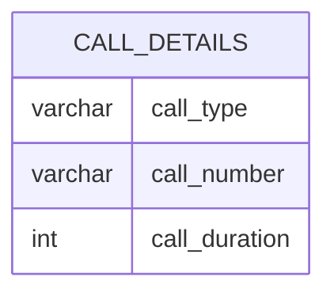

# Documentation for Table: dbo.call_details

## Overview
The `dbo.call_details` table is designed to store information about phone calls, likely for a telecommunications or customer service application. The table captures details such as the type of call (incoming or outgoing), the number associated with the call, and the duration of the call in seconds. This data can be used for analyzing call patterns, customer interactions, and operational metrics.

## Columns

| Name           | Type    | Nullable | Default | Description                          |
|----------------|---------|----------|---------|--------------------------------------|
| call_type      | varchar | Yes      | None    | Type of the call (e.g., OUT, IN)    |
| call_number    | varchar | Yes      | None    | The phone number associated with the call |
| call_duration   | int     | Yes      | None    | Duration of the call in seconds      |

## Keys & Relationships
- **Primary Keys:** None defined.
- **Foreign Keys:** None defined.

## Indexes
- **No indexes defined.** This may lead to slower query performance when filtering or sorting by any of the columns. Consider adding indexes on `call_number` or `call_type` if frequent lookups are performed on these fields.

## Sample Data

| call_type | call_number | call_duration |
|-----------|-------------|---------------|
| OUT       | 181868      | 13            |
| OUT       | 2159010     | 8             |
| OUT       | 2159010     | 178           |

## Data Volume
The `dbo.call_details` table currently contains approximately **20 rows**. This volume is relatively small, which may not pose significant performance issues. However, as the volume grows, it may require optimization strategies such as indexing or partitioning to maintain query performance.

## Data Quality Red Flags
- **Nullable Columns:** All columns are nullable, which may lead to incomplete records if not properly managed.
- **Lack of Primary Key:** The absence of a primary key could result in duplicate records, especially for `call_number` and `call_type`.
- **No Foreign Keys:** Without foreign keys, there is no enforced relationship with other tables, which may lead to data integrity issues.
- **Potential for Duplicate Call Numbers:** The sample data shows the same `call_number` appearing multiple times, which could indicate a lack of unique identification for calls.