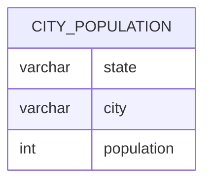

# Documentation for Table: dbo.city_population

## Overview
The `dbo.city_population` table is designed to store population data for various cities within different states. The inferred business purpose of this table is to provide a centralized repository for demographic information, which can be utilized for analysis, reporting, and decision-making related to urban planning, resource allocation, and regional development.

## Columns

| Name        | Type      | Nullable | Default | Description                          |
|-------------|-----------|----------|---------|--------------------------------------|
| state       | varchar   | Yes      | None    | The state where the city is located.|
| city        | varchar   | Yes      | None    | The name of the city.               |
| population  | int       | Yes      | None    | The population count of the city.   |

## Keys & Relationships
- **Primary Keys**: None defined.
- **Foreign Keys**: None defined.

## Indexes
- **No indexes defined**: This may lead to slower query performance when searching or filtering by `state` or `city`. Adding indexes on these columns could improve query efficiency.

## Sample Data

| state   | city     | population |
|---------|----------|------------|
| haryana | ambala   | 100        |
| haryana | panipat  | 200        |
| haryana | gurgaon  | 300        |

## Data Volume
The `dbo.city_population` table currently contains approximately **12 rows**. This volume suggests that the dataset is relatively small, which may allow for quick queries and analysis. However, as the dataset grows, performance considerations may need to be addressed, particularly regarding indexing and data retrieval strategies.

## Data Quality Red Flags
- **Nullable Columns**: All columns in the table are nullable, which could lead to incomplete records if not managed properly.
- **Lack of Primary Key**: The absence of a primary key may result in duplicate entries for the same city within a state, leading to data integrity issues.
- **No Foreign Keys**: Without foreign key constraints, there is no enforcement of relationships with other tables, which could lead to orphaned records or inconsistent data.

Overall, while the table serves a clear purpose, attention should be given to data integrity and quality to ensure reliable analysis and reporting.