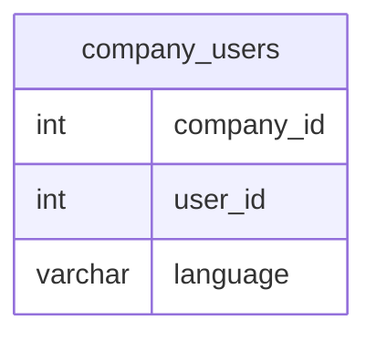

# Documentation for Table: dbo.company_users

## Overview
The `dbo.company_users` table is designed to store information about users associated with different companies. Each record likely represents a user and their preferred language within the context of a specific company. This table may be used to manage user preferences for language settings in applications or services provided by the company.

## Columns

| Name          | Type      | Nullable | Default | Description                          |
|---------------|-----------|----------|---------|--------------------------------------|
| company_id    | int       | Yes      | NULL    | Identifier for the company.          |
| user_id       | int       | Yes      | NULL    | Identifier for the user.             |
| language      | varchar(20)| Yes     | NULL    | Preferred language of the user.      |

## Keys & Relationships
- **Primary Keys**: None defined.
- **Foreign Keys**: None defined.

## Indexes
- **No indexes defined**: This may lead to performance issues when querying the table, especially as the data volume grows. Consider adding indexes on `company_id` and `user_id` for faster lookups.

## Sample Data

| company_id | user_id | language |
|------------|---------|----------|
| 1          | 1       | English  |
| 1          | 1       | German   |
| 1          | 2       | English  |

## Data Volume
The `dbo.company_users` table currently contains approximately **12 rows**. This volume is relatively small, which may not pose immediate performance concerns. However, as the number of users and companies increases, careful consideration should be given to indexing and potential normalization of the data.

## Data Quality Red Flags
- **Nullable Columns**: All columns are nullable, which may lead to incomplete records if not managed properly.
- **Lack of Primary Key**: The absence of a primary key could result in duplicate entries, as seen in the sample data where the same user (user_id 1) is associated with multiple languages under the same company (company_id 1).
- **No Foreign Key Constraints**: Without foreign key constraints, there is no enforcement of valid relationships between users and companies, which could lead to data integrity issues.