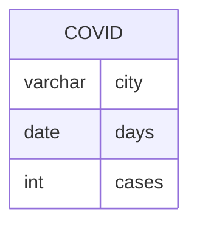

# Documentation for Table: dbo.covid

## Overview
The `dbo.covid` table is designed to store data related to COVID-19 cases reported in various cities over specific days. The inferred business purpose of this table is to track the number of COVID-19 cases on a daily basis for different cities, which can be useful for public health analysis, reporting, and decision-making.

## Columns

| Name   | Type    | Nullable | Default | Description                          |
|--------|---------|----------|---------|--------------------------------------|
| city   | varchar | Yes      | None    | The name of the city where cases are reported. |
| days   | date    | Yes      | None    | The date for which the case count is reported. |
| cases  | int     | Yes      | None    | The number of COVID-19 cases reported on the specified date. |

## Keys & Relationships
- **Primary Keys**: None defined.
- **Foreign Keys**: None defined.

## Indexes
- **Indexes**: No indexes defined for this table. Adding indexes on `city` and `days` could improve query performance for searches and aggregations based on these columns.

## Sample Data

| city  | days       | cases |
|-------|------------|-------|
| DELHI | 2022-01-01 | 100   |
| DELHI | 2022-01-02 | 200   |
| DELHI | 2022-01-03 | 300   |

## Data Volume
The `dbo.covid` table contains approximately **16 rows**. This volume suggests that the table may be used for a limited time frame or specific reporting periods. As the data grows, performance considerations may arise, particularly if queries become more complex or if additional columns are added.

## Data Quality Red Flags
- **Primary Key Absence**: The absence of a primary key may lead to duplicate entries for the same city and date, which could compromise data integrity.
- **Nullable Columns**: All columns are nullable, which raises concerns about the completeness of the data. It is essential to ensure that critical data points (like `cases`) are not left null.
- **No Indexes**: The lack of indexes may lead to performance issues as the dataset grows, especially for queries filtering by `city` or `days`. 

Overall, while the table serves a clear purpose, there are several areas for improvement to enhance data integrity and query performance.