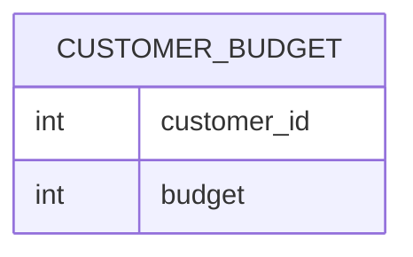

# Documentation for Table: dbo.customer_budget

## Overview
The `dbo.customer_budget` table is designed to store budget information associated with customers. Each record likely represents a customer's allocated budget for a specific period or project. The inferred business purpose is to track and manage customer budgets, which can be essential for financial planning, resource allocation, and performance analysis.

## Columns

| Name          | Type | Nullable | Default | Description                          |
|---------------|------|----------|---------|--------------------------------------|
| customer_id   | int  | Yes      | None    | Identifier for the customer.         |
| budget        | int  | Yes      | None    | The budget amount allocated to the customer. |

## Keys & Relationships
- **Primary Keys**: None defined.
- **Foreign Keys**: None defined.

## Indexes
No indexes are defined for the `customer_budget` table. Adding indexes on `customer_id` may improve query performance for lookups based on customer budgets.

## Sample Data

| customer_id | budget |
|-------------|--------|
| 100         | 400    |
| 200         | 800    |
| 300         | 1500   |

## Data Volume
The `dbo.customer_budget` table currently contains **3 rows**. This low volume suggests that the table may be in the early stages of data population or that it is used for a limited number of customers. As the business grows, monitoring the volume will be essential for performance and storage considerations.

## Data Quality Red Flags
- **Nullable Columns**: Both `customer_id` and `budget` columns are nullable, which may lead to incomplete records if not managed properly.
- **No Primary Key**: The absence of a primary key could lead to duplicate entries for the same customer, which may compromise data integrity.
- **Low Row Count**: With only 3 rows, it is unclear if this table is fully populated or if it is underutilized. Further investigation may be needed to understand its usage and data entry processes.