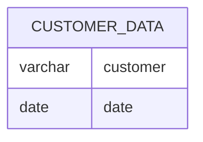

# Documentation for Table: dbo.customer_data

## Overview
The `dbo.customer_data` table appears to store information related to customers and their associated dates. The inferred business purpose of this table is likely to track customer interactions or events over time, such as purchases, visits, or other engagements. The absence of primary keys suggests that this table may be used for logging or tracking purposes rather than for uniquely identifying records.

## Columns

| Name      | Type    | Nullable | Default | Description                          |
|-----------|---------|----------|---------|--------------------------------------|
| customer  | varchar | Yes      | None    | Identifier for the customer          |
| date      | date    | Yes      | None    | Date associated with the customer    |

## Keys & Relationships
- **Primary Keys**: None defined.
- **Foreign Keys**: None defined.

## Indexes
- **No indexes defined**: This may impact query performance, especially for searches or filters on the `customer` or `date` columns.

## Sample Data

| customer | date       |
|----------|------------|
| cust_1   | 2024-12-01 |
| cust_1   | 2024-12-02 |
| cust_1   | 2024-12-03 |

## Data Volume
The table currently contains approximately **10 rows**. This volume is relatively small, which may not pose significant performance issues for queries. However, as the volume grows, considerations for indexing and data management will become increasingly important.

## Data Quality Red Flags
- **No Primary Key**: The absence of a primary key may lead to duplicate records, as seen in the sample data where the same customer appears multiple times with different dates.
- **Nullable Columns**: Both columns are nullable, which could lead to incomplete records if not managed properly.
- **Lack of Indexes**: The absence of indexes may hinder performance for queries that filter or sort by `customer` or `date`. 

Overall, while the table serves a purpose in tracking customer data, improvements in structure and indexing may be necessary for better data integrity and performance.