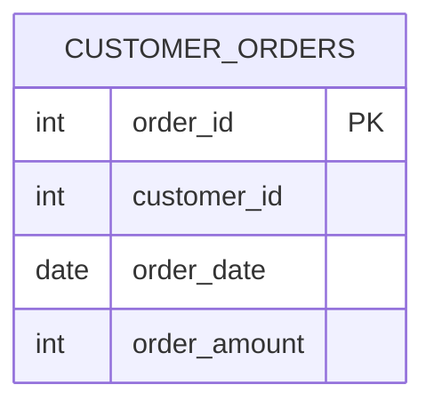

# Documentation for Table: dbo.customer_orders

## Overview
The `dbo.customer_orders` table is designed to store information about customer orders within a business context. Each record represents an individual order placed by a customer, capturing essential details such as the order ID, customer ID, order date, and the total amount of the order. This table likely serves as a foundational component for analyzing customer purchasing behavior, tracking sales performance, and managing order fulfillment.

## Columns

| Name            | Type   | Nullable | Default | Description                          |
|-----------------|--------|----------|---------|--------------------------------------|
| order_id        | int    | Yes      | NULL    | Unique identifier for each order (PK) |
| customer_id     | int    | Yes      | NULL    | Identifier for the customer placing the order |
| order_date      | date   | Yes      | NULL    | Date when the order was placed      |
| order_amount    | int    | Yes      | NULL    | Total amount for the order           |

## Keys & Relationships
- **Primary Keys**: None defined.
- **Foreign Keys**: None defined.

## Indexes
- **No indexes defined**: This may impact query performance, especially for searches or joins involving the `customer_id` or `order_date` columns.

## Sample Data

| order_id | customer_id | order_date | order_amount |
|----------|-------------|------------|--------------|
| 1        | 100         | 2022-01-01 | 2000         |
| 2        | 200         | 2022-01-01 | 2500         |
| 3        | 300         | 2022-01-01 | 2100         |

## Data Volume
The `dbo.customer_orders` table currently contains approximately **9 rows**. This volume suggests that the table may be in the early stages of data population or that it is used for a specific subset of orders. As the business grows, monitoring the volume will be essential for performance and storage considerations.

## Data Quality Red Flags
- **Primary Key Absence**: The lack of a primary key may lead to duplicate records and challenges in maintaining data integrity.
- **Nullable Columns**: All columns are nullable, which could result in incomplete records if not managed properly.
- **No Foreign Keys**: The absence of foreign keys means there is no enforced relationship with a customer table, which could lead to orphaned records or inconsistencies in customer data.

Overall, while the `dbo.customer_orders` table serves a critical function, it requires enhancements in terms of keys and indexes to ensure data integrity and query performance.