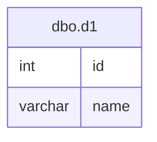

# Documentation for Table: dbo.d1

## Overview
The `dbo.d1` table appears to be a simple data structure that likely stores a collection of records identified by an `id` and associated with a `name`. Given the column names, it seems to serve a purpose related to storing user or entity identifiers along with their corresponding names. The lack of primary keys suggests that the table may not enforce uniqueness, which could lead to duplicate entries.

## Columns

| Name      | Type    | Nullable | Default | Description                       |
|-----------|---------|----------|---------|-----------------------------------|
| id        | int     | Yes      | None    | Identifier for the record.       |
| name      | varchar | Yes      | None    | Name associated with the identifier. |

## Keys & Relationships
- **Primary Keys**: None defined.
- **Foreign Keys**: None defined.

## Indexes
- **No indexes defined**: This may lead to performance issues for queries that filter or sort by `id` or `name`, as there are no optimizations in place for these operations.

## Sample Data

| id | name  |
|----|-------|
| 1  | Ajith |
| 1  | Praj  |
| 1  | Moosa |

## Data Volume
The table currently contains approximately **4 rows**. The presence of duplicate `id` values indicates that the table may not be optimized for unique records, which could complicate data retrieval and integrity.

## Data Quality Red Flags
- **Duplicate `id` values**: The same `id` (1) is associated with multiple names, which raises concerns about data integrity and uniqueness.
- **Nullable columns**: Both columns are nullable, which may lead to incomplete records if not managed properly.
- **Lack of primary key**: The absence of a primary key may result in difficulties in maintaining data integrity and could allow for unintended duplicate entries.