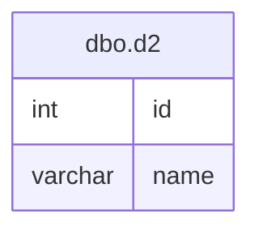

# Documentation for Table: dbo.d2

## Overview
The `dbo.d2` table appears to be a simple data structure that likely serves to store a collection of entities identified by an `id` and associated with a `name`. Given the column names, it may represent a list of individuals or items, where each entry is uniquely identified by an `id`. The business purpose could involve tracking or managing a small set of records, possibly for a specific application or module within a larger system.

## Columns

| Name      | Type    | Nullable | Default | Description                     |
|-----------|---------|----------|---------|---------------------------------|
| id        | int     | Yes      | None    | Identifier for the record.      |
| name      | varchar | Yes      | None    | Name associated with the record. |

## Keys & Relationships
- **Primary Keys**: None defined.
- **Foreign Keys**: None defined.

## Indexes
- **No indexes defined**: This table does not have any indexes, which may lead to performance issues for queries that filter or sort by the `id` or `name` columns.

## Sample Data

| id | name  |
|----|-------|
| 1  | Ajith |
| 1  | Praj  |

## Data Volume
The `dbo.d2` table currently contains **2 rows**. This low volume suggests that the table may be in the early stages of data entry or may serve a very specific purpose with limited data requirements.

## Data Quality Red Flags
- **Duplicate IDs**: The sample data shows that the `id` column has duplicate values (both entries have `id` = 1). This could indicate a lack of a primary key or unique constraint, which may lead to data integrity issues.
- **Nullable Columns**: Both columns are nullable, which could lead to incomplete records if not managed properly.
- **Short Name Length**: The `name` column has a maximum length of 5 characters, which may be insufficient for many names, potentially leading to data truncation or loss of information.