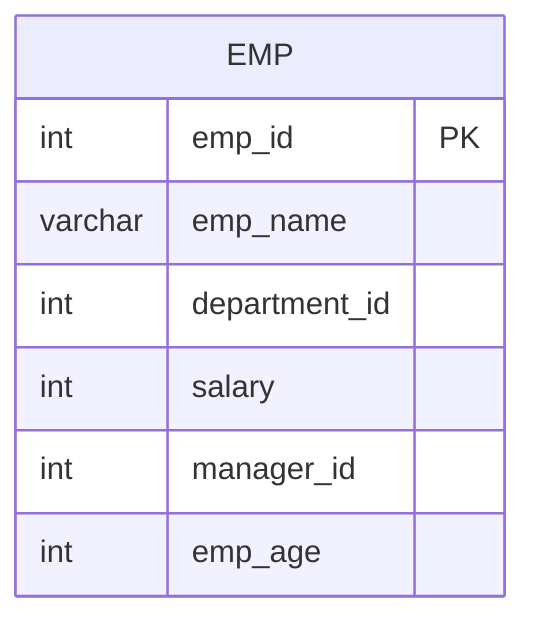

# Documentation for Table: dbo.emp

## Overview
The `dbo.emp` table is designed to store employee information within an organization. It likely serves as a central repository for employee-related data, including personal details, salary information, and departmental affiliations. This table can be used for various HR-related queries, such as payroll processing, employee management, and reporting.

## Columns

| Name            | Type       | Nullable | Default | Description                          |
|-----------------|------------|----------|---------|--------------------------------------|
| emp_id          | int        | Yes      | None    | Unique identifier for each employee. (PK) |
| emp_name        | varchar(20)| Yes      | None    | Name of the employee.                |
| department_id   | int        | Yes      | None    | Identifier for the department the employee belongs to. |
| salary          | int        | Yes      | None    | Salary of the employee.              |
| manager_id      | int        | Yes      | None    | Identifier for the employee's manager. |
| emp_age         | int        | Yes      | None    | Age of the employee.                 |

## Keys & Relationships
- **Primary Keys**: None defined.
- **Foreign Keys**: None defined.

## Indexes
- **No indexes defined**: This may affect query performance, especially for searches or joins involving the `emp_id`, `department_id`, or `manager_id` columns.

## Sample Data

| emp_id | emp_name | department_id | salary | manager_id | emp_age |
|--------|----------|---------------|--------|------------|---------|
| 1      | Ankit    | 100           | 10000  | 4          | 39      |
| 2      | Mohit    | 100           | 15000  | 5          | 48      |
| 3      | Vikas    | 100           | 10000  | 4          | 37      |

## Data Volume
The `dbo.emp` table currently contains approximately **10 rows**. This volume suggests that the table may be in the early stages of data population or that it is intended for a smaller organization or department.

## Data Quality Red Flags
- **Primary Key Absence**: The absence of a primary key may lead to duplicate records and data integrity issues.
- **Nullable Columns**: All columns are nullable, which could result in incomplete records if not managed properly.
- **Lack of Foreign Keys**: Without foreign keys, there is no enforced relationship with other tables, which may lead to orphaned records or inconsistent data.
- **No Indexes**: The absence of indexes may hinder performance for queries that involve searching or filtering on the columns.

Overall, while the `dbo.emp` table serves a clear purpose, there are several areas for improvement regarding data integrity and performance.