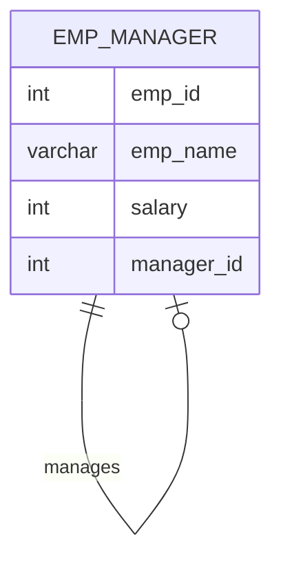

# Documentation for Table: dbo.emp_manager

## Overview
The `dbo.emp_manager` table appears to store information about employees and their respective managers within an organization. Each record likely represents an employee, including their unique identifier, name, salary, and the identifier of their manager. This structure suggests a hierarchical relationship between employees and managers, which is common in organizational databases.

## Columns

| Name         | Type      | Nullable | Default | Description                          |
|--------------|-----------|----------|---------|--------------------------------------|
| emp_id      | int       | Yes      | None    | Unique identifier for the employee. |
| emp_name    | varchar(50)| Yes     | None    | Name of the employee.                |
| salary       | int       | Yes      | None    | Salary of the employee.              |
| manager_id   | int       | Yes      | None    | Identifier of the employee's manager.|

## Keys & Relationships
- **Primary Keys**: None defined.
- **Foreign Keys**: None defined.

## Indexes
- **No indexes defined**: This may lead to performance issues for queries that filter or join on the `emp_id` or `manager_id` columns.

## Sample Data

| emp_id | emp_name | salary | manager_id |
|--------|----------|--------|------------|
| 1      | Ankit    | 10000  | 4          |
| 2      | Mohit    | 15000  | 5          |
| 3      | Vikas    | 10000  | 4          |

## Data Volume
The `dbo.emp_manager` table contains approximately **8 rows**. This volume is relatively small, which may not pose significant performance issues for queries. However, as the organization grows, the table may require optimization through indexing and normalization.

## Data Quality Red Flags
- **Primary Key Missing**: The absence of a primary key could lead to duplicate records and data integrity issues.
- **Nullable Columns**: All columns are nullable, which may result in incomplete records if not managed properly.
- **Manager ID**: The `manager_id` field is nullable and could lead to ambiguity regarding employee management hierarchy if not consistently populated. 

Overall, while the table serves a clear purpose, improvements in data integrity and structure are recommended to ensure reliable and efficient data management.