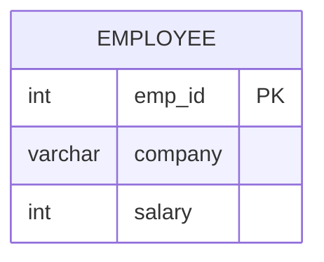

# Documentation for Table: dbo.employee

## Overview
The `dbo.employee` table is designed to store information about employees within a company. It likely serves the purpose of tracking employee identifiers, their associated company, and their salary information. This table may be used for payroll processing, employee management, and reporting purposes.

## Columns

| Name       | Type      | Nullable | Default | Description                       |
|------------|-----------|----------|---------|-----------------------------------|
| emp_id    | int       | Yes      | None    | Unique identifier for each employee (PK) |
| company    | varchar(10) | Yes    | None    | The company to which the employee belongs |
| salary     | int       | Yes      | None    | The salary of the employee         |

## Keys & Relationships
- **Primary Keys**: None defined.
- **Foreign Keys**: None defined.

## Indexes
No indexes are defined for the `dbo.employee` table. This may impact query performance, especially for searches or joins involving the `emp_id`, `company`, or `salary` columns.

## Sample Data

| emp_id | company | salary |
|--------|---------|--------|
| 1      | A       | 2341   |
| 2      | A       | 341    |
| 3      | A       | 15     |

## Data Volume
The `dbo.employee` table contains approximately **17 rows**. This volume suggests that the table may be in the early stages of data population or that it is intended for a small organization or a specific department within a larger company.

## Data Quality Red Flags
- **Primary Key Absence**: The absence of a primary key may lead to duplicate records and data integrity issues.
- **Nullable Columns**: All columns are nullable, which could result in incomplete records if not managed properly.
- **Short varchar Length**: The `company` column has a maximum length of 10 characters, which may be insufficient for longer company names, potentially leading to data truncation.
- **Lack of Indexes**: The absence of indexes may hinder performance for queries that filter or sort based on the `emp_id`, `company`, or `salary` columns.