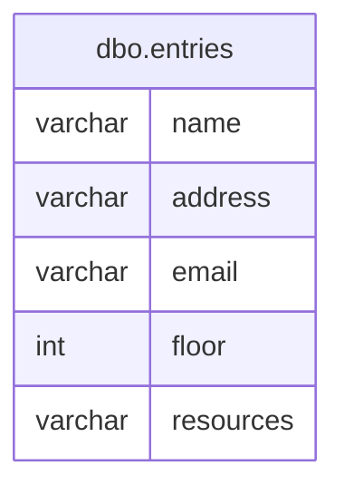

# Documentation for Table: dbo.entries

## Overview
The `dbo.entries` table appears to store information related to various entities, likely representing individuals or organizations. The columns suggest that the table captures basic contact information, including names, addresses, email addresses, and possibly details about physical locations (floors) and resources associated with these entities. The lack of primary keys and foreign keys indicates that this table may be used for temporary or unstructured data storage, or it may be part of a larger schema where relationships are defined elsewhere.

## Columns

| Name       | Type      | Nullable | Default | Description                          |
|------------|-----------|----------|---------|--------------------------------------|
| name       | varchar(20) | Yes      | None    | The name of the entity.              |
| address    | varchar(20) | Yes      | None    | The address of the entity.           |
| email      | varchar(20) | Yes      | None    | The email address of the entity.     |
| floor      | int       | Yes      | None    | The floor number associated with the entity. |
| resources  | varchar(10) | Yes      | None    | The resources associated with the entity. |

## Keys & Relationships
- **Primary Keys**: None defined.
- **Foreign Keys**: None defined.

## Indexes
- **Indexes**: None defined. 
  - This suggests that queries may not be optimized for performance, and full table scans may be necessary for data retrieval.

## Sample Data

| name | address   | email          | floor | resources |
|------|-----------|----------------|-------|-----------|
| A    | Bangalore | A@gmail.com    | 1     | CPU       |
| A    | Bangalore | A1@gmail.com   | 1     | CPU       |
| A    | Bangalore | A2@gmail.com   | 2     | DESKTOP   |

## Data Volume
The `dbo.entries` table currently contains approximately **6 rows**. This volume is relatively small, which may imply that performance issues are not a concern at this time. However, as the data grows, the lack of indexing could lead to slower query performance.

## Data Quality Red Flags
- **Lack of Primary Key**: The absence of a primary key raises concerns about data integrity and the potential for duplicate entries.
- **Nullable Columns**: All columns are nullable, which may lead to incomplete records if not managed properly.
- **Short Lengths for Strings**: The maximum lengths for `varchar` fields (20 for name, address, and email; 10 for resources) may be insufficient for real-world data, leading to truncation.
- **Repetitive Data**: The sample data shows multiple entries with the same name and address but different emails, which could indicate redundancy or a lack of normalization.

Overall, while the table serves a purpose, there are several areas for improvement in terms of data integrity and quality management.