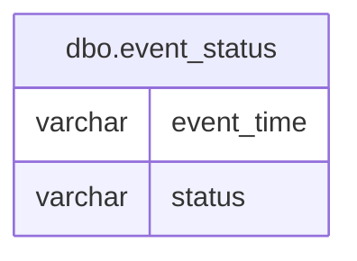

# Documentation for Table: dbo.event_status

## Overview
The `dbo.event_status` table is designed to track the status of various events over time. Each record captures a specific event's time and its corresponding status, which could indicate whether the event is currently active, inactive, or in another state. This table likely serves as a log for monitoring events, enabling users to analyze trends or changes in event statuses over time.

## Columns

| Name        | Type    | Nullable | Default | Description                       |
|-------------|---------|----------|---------|-----------------------------------|
| event_time  | varchar | Yes      | None    | The time at which the event occurred. |
| status      | varchar | Yes      | None    | The current status of the event. |

## Keys & Relationships
- **Primary Keys**: None defined for this table.
- **Foreign Keys**: None defined for this table.

## Indexes
- **No indexes defined**: This table currently has no indexes, which may affect query performance when searching or filtering by `event_time` or `status`. Adding indexes could improve performance for frequent queries.

## Sample Data

| event_time | status |
|------------|--------|
| 10:01      | on     |
| 10:02      | on     |
| 10:03      | on     |

## Data Volume
The `dbo.event_status` table contains approximately **9 rows**. This volume is relatively small, which may not pose significant performance issues. However, as the volume grows, it may be necessary to consider indexing strategies to maintain query performance.

## Data Quality Red Flags
- **Nullable Columns**: Both `event_time` and `status` columns are nullable, which could lead to incomplete records if not managed properly.
- **Lack of Primary Key**: The absence of a primary key may result in duplicate records, making it difficult to ensure data integrity.
- **Data Type Considerations**: The use of `varchar` for time representation may lead to inconsistencies in time formatting. A more appropriate data type (e.g., `TIME`) could enhance data quality.