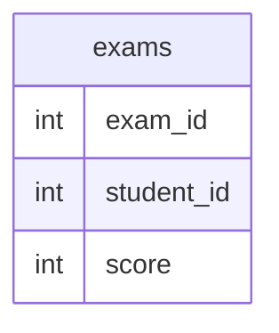

# Documentation for Table: dbo.exams

## Overview
The `dbo.exams` table is designed to store information about student exam scores. Each record likely represents a student's performance on a specific exam, capturing the relationship between students and their scores. This table can be used for educational analytics, performance tracking, and reporting purposes.

## Columns

| Name        | Type | Nullable | Default | Description                          |
|-------------|------|----------|---------|--------------------------------------|
| exam_id    | int  | Yes      | None    | Identifier for the exam              |
| student_id  | int  | Yes      | None    | Identifier for the student           |
| score       | int  | Yes      | None    | Score achieved by the student        |

## Keys & Relationships
- **Primary Keys**: None defined.
- **Foreign Keys**: None defined.

## Indexes
No indexes are defined for the `dbo.exams` table. Adding indexes on `student_id` or `exam_id` could improve query performance for lookups based on these columns.

## Sample Data

| exam_id | student_id | score |
|---------|------------|-------|
| 10      | 1          | 70    |
| 10      | 2          | 80    |
| 10      | 3          | 90    |

## Data Volume
The `dbo.exams` table currently contains approximately **10 rows**. This volume is relatively small, which may not pose significant performance issues for queries. However, as the number of records grows, it may be necessary to consider indexing strategies to maintain query performance.

## Data Quality Red Flags
- **Primary Key Absence**: The table lacks a primary key, which could lead to duplicate records and data integrity issues.
- **Nullable Columns**: All columns are nullable, which may result in incomplete records if not managed properly.
- **Foreign Key Relationships**: There are no foreign keys defined, which raises concerns about referential integrity with other tables (e.g., students or exams).

Overall, while the table serves its purpose, improvements in structure and constraints are recommended to enhance data quality and integrity.