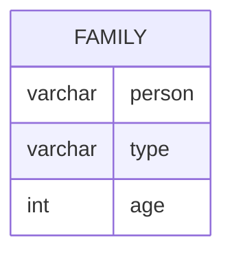

# Documentation for Table: dbo.family

## Overview
The `dbo.family` table appears to store information about individuals within a family unit. The inferred business purpose is to maintain a record of family members, their types (likely categorizing them as Adult, Child, etc.), and their ages. This table could be used in applications related to family management, demographic studies, or social services.

## Columns

| Name    | Type    | Nullable | Default | Description                       |
|---------|---------|----------|---------|-----------------------------------|
| person  | varchar | Yes      | None    | Identifier for the person (max 5 characters) |
| type    | varchar | Yes      | None    | Type of family member (e.g., Adult, Child) (max 10 characters) |
| age     | int     | Yes      | None    | Age of the family member          |

## Keys & Relationships
- **Primary Keys**: None defined.
- **Foreign Keys**: None defined.

## Indexes
- **No indexes defined**: This may affect query performance, especially for searches or joins on the `person`, `type`, or `age` columns.

## Sample Data

| person | type  | age |
|--------|-------|-----|
| A1     | Adult | 54  |
| A2     | Adult | 53  |
| A3     | Adult | 52  |

## Data Volume
The `dbo.family` table currently contains approximately **10 rows**. This volume is relatively small, which may not pose significant performance issues for queries. However, as the data grows, indexing and optimization strategies may need to be considered.

## Data Quality Red Flags
- **Nullable Columns**: All columns are nullable, which could lead to incomplete records if not managed properly.
- **Lack of Primary Key**: The absence of a primary key may result in duplicate entries or difficulty in uniquely identifying records.
- **Limited Data Types**: The `person` and `type` columns have a maximum length that may restrict the ability to store more descriptive identifiers or types in the future.