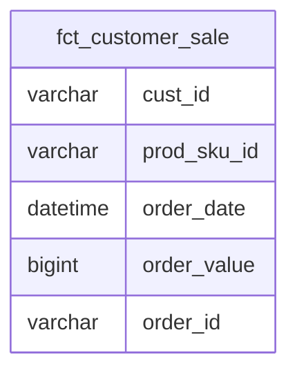

# Documentation for Table: dbo.fct_customer_sale

## Overview
The `dbo.fct_customer_sale` table is designed to capture sales transactions made by customers. It likely serves as a fact table in a data warehouse, where each record represents a sale event. The table includes details such as customer ID, product SKU, order date, order value, and order ID. This information can be used for sales analysis, customer behavior tracking, and inventory management.

## Columns

| Name           | Type      | Nullable | Default | Description                          |
|----------------|-----------|----------|---------|--------------------------------------|
| cust_id        | varchar(50) | Yes      | None    | Identifier for the customer          |
| prod_sku_id    | varchar(50) | Yes      | None    | Stock Keeping Unit identifier for the product |
| order_date     | datetime  | Yes      | None    | Date and time when the order was placed |
| order_value    | bigint    | Yes      | None    | Total value of the order             |
| order_id       | varchar(50) | Yes      | None    | Unique identifier for the order      |

## Keys & Relationships
- **Primary Keys**: None defined.
- **Foreign Keys**: None defined.

## Indexes
- **No indexes defined**: This may impact query performance, especially for large datasets. Queries filtering or joining on `cust_id`, `prod_sku_id`, or `order_date` may benefit from indexing.

## Sample Data

| cust_id | prod_sku_id | order_date           | order_value | order_id |
|---------|--------------|----------------------|-------------|----------|
| C001    | P100         | 2021-07-15 00:00:00  | 100         | O1001    |
| C002    | P101         | 2021-07-20 00:00:00  | 200         | O1002    |
| C001    | P100         | 2021-10-05 00:00:00  | 150         | O1003    |

## Data Volume
The `dbo.fct_customer_sale` table contains approximately **6 rows**. This low volume may indicate that the table is either new, underutilized, or that data is being aggregated from other sources. As the volume increases, performance considerations will become more critical.

## Data Quality Red Flags
- **Nullable Columns**: All columns are nullable, which may lead to incomplete records if not managed properly.
- **No Primary Key**: The absence of a primary key could result in duplicate records, making data integrity a concern.
- **No Foreign Keys**: Without foreign key constraints, there is no enforcement of referential integrity with other tables, which could lead to orphaned records or inconsistent data.

Overall, while the table serves a clear purpose in tracking customer sales, improvements in data integrity and indexing would enhance its reliability and performance.