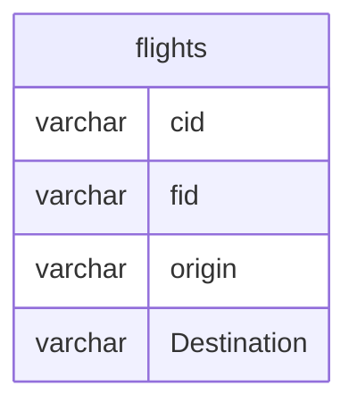

# Documentation for Table: dbo.flights

## Overview
The `dbo.flights` table is designed to store information about flights, including their unique identifiers, origins, and destinations. The inferred business purpose of this table is to facilitate the management and tracking of flight routes, which can be utilized for various applications such as flight scheduling, ticketing, and travel planning.

## Columns

| Name         | Type    | Nullable | Default | Description                       |
|--------------|---------|----------|---------|-----------------------------------|
| cid          | varchar | Yes      | NULL    | Customer ID associated with the flight. |
| fid          | varchar | Yes      | NULL    | Flight ID, a unique identifier for each flight. |
| origin       | varchar | Yes      | NULL    | The origin airport code or name. |
| Destination  | varchar | Yes      | NULL    | The destination airport code or name. |

## Keys & Relationships
- **Primary Keys**: None defined.
- **Foreign Keys**: None defined.

## Indexes
- **No indexes defined**: This may lead to performance issues for queries that filter or sort by any of the columns. Consider adding indexes on `fid`, `origin`, and `Destination` for improved query performance.

## Sample Data

| cid | fid | origin | Destination |
|-----|-----|--------|-------------|
| 1   | f1  | Del    | Hyd         |
| 1   | f2  | Hyd    | Blr         |
| 2   | f3  | Mum    | Agra        |

## Data Volume
The `dbo.flights` table currently contains approximately **5 rows**. This volume is relatively small, which may not pose immediate performance concerns. However, as the dataset grows, it will be important to monitor performance and consider indexing strategies.

## Data Quality Red Flags
- **Primary Key Absence**: The table lacks a primary key, which could lead to duplicate entries and data integrity issues.
- **Nullable Columns**: All columns are nullable, which may result in incomplete records if not managed properly.
- **Inconsistent Naming**: The column name "Destination" uses a capital "D" while others are lowercase, which may lead to confusion or errors in queries. Consistency in naming conventions is recommended.