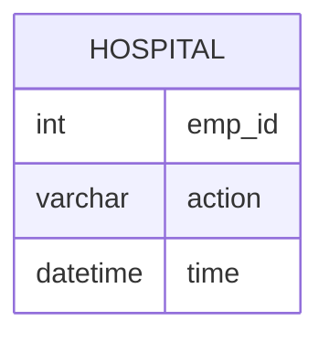

# Documentation for Table: dbo.hospital

## Overview
The `dbo.hospital` table appears to track employee actions within a hospital setting, specifically logging when employees check in and out. This could be used for attendance tracking, shift management, or monitoring employee presence in the facility. The absence of primary keys suggests that the table may not uniquely identify records, which could lead to challenges in data integrity and retrieval.

## Columns

| Name      | Type       | Nullable | Default | Description                          |
|-----------|------------|----------|---------|--------------------------------------|
| emp_id    | int        | Yes      | NULL    | Identifier for the employee.         |
| action    | varchar(10)| Yes      | NULL    | Action taken by the employee (e.g., 'in', 'out'). |
| time      | datetime   | Yes      | NULL    | Timestamp of the action.             |

## Keys & Relationships
- **Primary Keys**: None defined.
- **Foreign Keys**: None defined.

## Indexes
- **No indexes defined**: This may affect query performance, especially for searches or aggregations based on `emp_id`, `action`, or `time`.

## Sample Data

| emp_id | action | time                 |
|--------|--------|----------------------|
| 1      | in     | 2019-12-22 09:00:00  |
| 1      | out    | 2019-12-22 09:15:00  |
| 2      | in     | 2019-12-22 09:00:00  |

## Data Volume
The table contains approximately **11 rows**. This volume is relatively small, which may not pose immediate performance issues. However, as the data grows, the lack of primary keys and indexes could lead to inefficiencies in data retrieval and management.

## Data Quality Red Flags
- **No Primary Key**: The absence of a primary key raises concerns about data integrity and the ability to uniquely identify records.
- **Nullable Columns**: All columns are nullable, which could lead to incomplete records if not managed properly.
- **Potential for Duplicate Records**: Without a primary key, there is a risk of duplicate entries for the same employee and action at the same time, which could complicate data analysis and reporting.