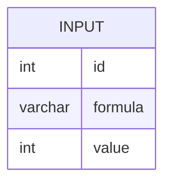

# Documentation for Table: dbo.input

## Overview
The `dbo.input` table appears to store mathematical expressions (formulas) along with their corresponding computed values. This table could be used in a system that processes or evaluates mathematical calculations, potentially for applications in finance, engineering, or educational tools. The presence of a formula and its resultant value suggests that this table may serve as an input repository for further calculations or analyses.

## Columns

| Name      | Type      | Nullable | Default | Description                          |
|-----------|-----------|----------|---------|--------------------------------------|
| id        | int       | Yes      | None    | Unique identifier for each entry.   |
| formula   | varchar(10) | Yes    | None    | The mathematical formula as a string.|
| value     | int       | Yes      | None    | The computed result of the formula. |

## Keys & Relationships
- **Primary Keys**: None defined.
- **Foreign Keys**: None defined.

## Indexes
- **No indexes defined**: This may impact query performance, especially for searches or lookups based on the `formula` or `value` columns.

## Sample Data

| id | formula | value |
|----|---------|-------|
| 1  | 1+4     | 10    |
| 2  | 2+1     | 5     |
| 3  | 3-2     | 40    |

## Data Volume
The `dbo.input` table currently contains approximately **4 rows**. This low volume suggests that the table may be in the early stages of data collection or that it is used for specific, limited inputs. As the volume increases, performance considerations may need to be addressed, particularly regarding indexing and query optimization.

## Data Quality Red Flags
- **Primary Key Absence**: The lack of a primary key may lead to duplicate entries and data integrity issues.
- **Nullable Columns**: All columns are nullable, which could result in incomplete records if not managed properly.
- **Sample Data Values**: The `value` column contains a computed result that may not align with the `formula` provided, indicating potential data entry errors or inconsistencies in how formulas are evaluated. 

Overall, while the table serves a clear purpose, the absence of constraints and the nullable nature of all columns raise concerns about data integrity and quality.