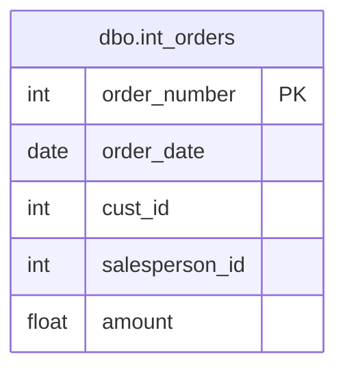

# Documentation for Table: dbo.int_orders

## Overview
The `dbo.int_orders` table is designed to store information about customer orders within a business context. Each record represents a unique order placed by a customer, capturing essential details such as the order number, date of the order, customer ID, salesperson ID, and the total amount of the order. This table likely serves as a foundational component for order management and sales reporting.

## Columns

| Name               | Type   | Nullable | Default | Description                          |
|--------------------|--------|----------|---------|--------------------------------------|
| order_number (PK)  | int    | false    | null    | Unique identifier for each order.   |
| order_date         | date   | false    | null    | The date when the order was placed. |
| cust_id            | int    | false    | null    | Identifier for the customer placing the order. |
| salesperson_id     | int    | false    | null    | Identifier for the salesperson handling the order. |
| amount             | float  | false    | null    | Total amount for the order.         |

## Keys & Relationships
- **Primary Keys**: 
  - `order_number` (PK)
  
- **Foreign Keys**: 
  - None defined.

## Indexes
- No indexes are defined for this table. Adding indexes on `cust_id` and `salesperson_id` could improve query performance for searches and joins involving these columns.

## Sample Data

| order_number | order_date | cust_id | salesperson_id | amount  |
|--------------|------------|---------|----------------|---------|
| 30           | 1995-07-14 | 9       | 1              | 460.0   |
| 10           | 1996-08-02 | 4       | 2              | 540.0   |
| 40           | 1998-01-29 | 7       | 2              | 2400.0  |

## Data Volume
The `dbo.int_orders` table currently contains approximately **7 rows**. This volume suggests that the table may be in the early stages of data accumulation or that it is part of a larger dataset where orders are recorded in a different manner.

## Data Quality Red Flags
- **Primary Key**: The `order_number` column is marked as a primary key, but it is not explicitly defined in the schema. This could lead to potential issues with data integrity if not enforced.
- **Foreign Keys**: There are no foreign keys defined, which may lead to orphaned records if customer or salesperson data is deleted.
- **Nullable Columns**: All columns are marked as non-nullable, which is good for data integrity, but it may lead to issues if data is not provided during order entry.
- **Indexes**: The absence of indexes may hinder performance for queries that involve searching or filtering based on `cust_id` or `salesperson_id`. 

Overall, while the table structure appears sound, the lack of defined relationships and indexes could pose challenges as the dataset grows.