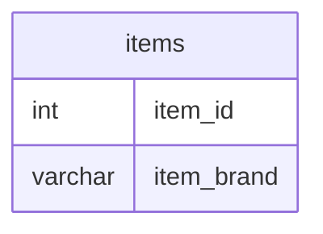

# Documentation for Table: dbo.items

## Overview
The `dbo.items` table is designed to store information about various items, specifically focusing on their unique identifiers and associated brands. This table likely serves as a foundational component for inventory management or product cataloging within a business context, allowing for the tracking and categorization of items based on their brand.

## Columns

| Name        | Type    | Nullable | Default | Description                       |
|-------------|---------|----------|---------|-----------------------------------|
| item_id    | int     | Yes      | None    | Unique identifier for each item.  |
| item_brand  | varchar | Yes      | None    | Brand name associated with the item. |

## Keys & Relationships
- **Primary Keys**: None defined.
- **Foreign Keys**: None defined.

## Indexes
- **No indexes defined**: This may impact query performance, especially for searches or joins involving the `item_id` or `item_brand` columns.

## Sample Data

| item_id | item_brand |
|---------|------------|
| 1       | Samsung    |
| 2       | Lenovo     |
| 3       | LG         |

## Data Volume
The `dbo.items` table currently contains approximately **4 rows**. This low volume suggests that the table may be in the early stages of data population or that it is intended for a limited set of items. As the business grows, the volume may increase, necessitating performance considerations for queries and data management.

## Data Quality Red Flags
- **Nullable Columns**: Both `item_id` and `item_brand` are nullable, which may lead to potential data integrity issues if not managed properly.
- **Lack of Primary Key**: The absence of a primary key could result in duplicate entries or difficulty in uniquely identifying records.
- **No Foreign Keys**: Without foreign key constraints, there is no enforcement of relationships with other tables, which could lead to orphaned records or inconsistent data.

Overall, while the `dbo.items` table serves a clear purpose, there are several areas for improvement regarding data integrity and structure.