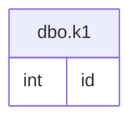

# Documentation for Table: dbo.k1

## Overview
The `dbo.k1` table appears to be a simple data structure that likely serves as a record holder for unique identifiers. Given that it contains only one column, `id`, it may be used for tracking or referencing entities in a broader system. The lack of primary keys suggests that this table may not enforce uniqueness, which could imply that it is used for logging or temporary storage of identifiers rather than as a definitive record.

## Columns

| Name | Type | Nullable | Default | Description |
|------|------|----------|---------|-------------|
| id (PK) | int | Yes | None | An identifier that may represent an entity or record. |

## Keys & Relationships
- **Primary Keys**: None defined.
- **Foreign Keys**: None defined.

## Indexes
- **No indexes defined**: This table does not have any indexes, which may lead to performance issues when querying large datasets. Queries that filter or sort by the `id` column may benefit from an index if the table grows significantly.

## Sample Data

| id |
|----|
| 1  |
| 1  |
| 1  |

## Data Volume
The `dbo.k1` table currently contains approximately **7 rows**. This volume is relatively small, which may not pose immediate performance concerns. However, as the table grows, the absence of primary keys and indexes could lead to inefficiencies in data retrieval and management.

## Data Quality Red Flags
- **No Primary Key**: The absence of a primary key raises concerns about data integrity and uniqueness. This could lead to duplicate entries, as evidenced by the sample data showing multiple rows with the same `id`.
- **Nullable Column**: The `id` column is nullable, which may allow for the insertion of null values, potentially complicating data analysis and integrity.
- **Sample Data Duplication**: The sample data shows repeated values for `id`, indicating that the table may not be designed to enforce unique identifiers, which could lead to confusion in data interpretation.