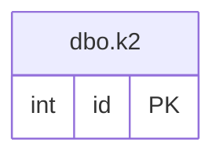

# Documentation for Table: dbo.k2

## Overview
The `dbo.k2` table appears to be a simple table that stores integer identifiers. Given the name and structure, it likely serves as a reference or lookup table, possibly for categorizing or indexing other entities in the database. The lack of additional columns suggests that it may be used for a specific purpose, such as tracking unique identifiers or serving as a foreign key reference in other tables.

## Columns

| Name | Type | Nullable | Default | Description |
|------|------|----------|---------|-------------|
| id (PK) | int | Yes | None | Unique identifier for records in this table. |

## Keys & Relationships
- **Primary Keys**: None defined, but the `id` column is likely intended to be a primary key based on its naming convention.
- **Foreign Keys**: None defined.

## Indexes
- **No indexes defined**: This table does not have any indexes, which may affect query performance when searching for specific `id` values.

## Sample Data

| id |
|----|
| 1  |
| 1  |
| 2  |

## Data Volume
The `dbo.k2` table contains approximately 6 rows. This low volume suggests that it may be used for a limited set of identifiers, which could be beneficial for performance in lookups but may also indicate that the table is not fully utilized or populated.

## Data Quality Red Flags
- The `id` column is nullable, which could lead to potential issues if null values are allowed in a table that is expected to serve as a unique identifier.
- The presence of duplicate values (e.g., two rows with `id` = 1) raises concerns about data integrity and the intended use of this table as a unique identifier.
- The lack of primary keys and indexes may lead to inefficient queries and data retrieval issues.