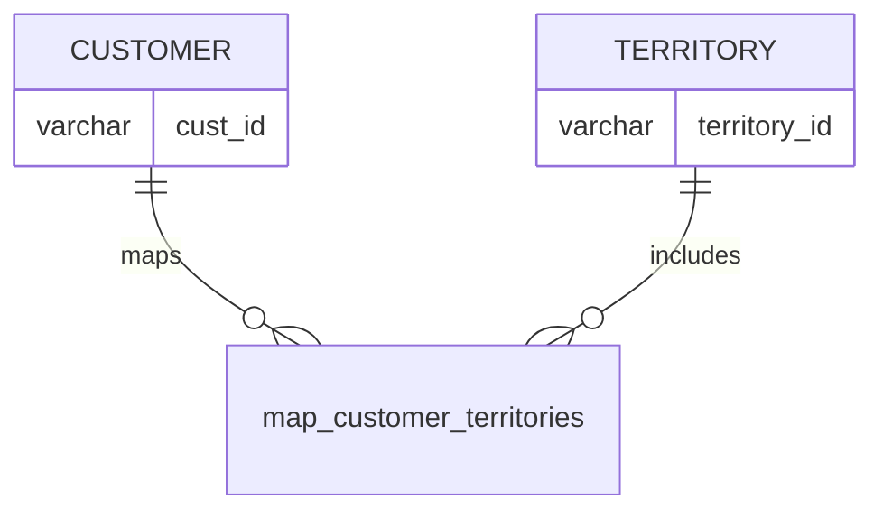

# Documentation for Table: dbo.map_customer_territories

## Overview
The `dbo.map_customer_territories` table is designed to associate customers with specific territories. This mapping likely serves a business purpose of organizing customer data based on geographical or operational territories, which can be useful for sales, marketing, and service delivery strategies. By linking customers to territories, the organization can better manage resources, tailor services, and analyze performance across different regions.

## Columns

| Name          | Type    | Nullable | Default | Description                          |
|---------------|---------|----------|---------|--------------------------------------|
| cust_id       | varchar | Yes      | NULL    | Identifier for the customer.        |
| territory_id  | varchar | Yes      | NULL    | Identifier for the territory.       |

## Keys & Relationships
- **Primary Keys**: None defined.
- **Foreign Keys**: None defined.

## Indexes
No indexes are defined for the `map_customer_territories` table. Adding indexes on `cust_id` and `territory_id` could improve query performance, especially for lookups and joins involving these columns.

## Sample Data

| cust_id | territory_id |
|---------|---------------|
| C001    | T001          |
| C002    | T002          |
| C003    | T003          |

## Data Volume
The `map_customer_territories` table currently contains approximately **3 rows**. This low volume suggests that the table may be in the early stages of data population or that it is used for a limited scope of customers and territories.

## Data Quality Red Flags
- **Nullable Columns**: Both `cust_id` and `territory_id` are nullable, which may lead to incomplete mappings if not managed properly.
- **No Primary Key**: The absence of a primary key could lead to duplicate entries, making data integrity a concern.
- **Limited Sample Data**: The small number of sample rows may not provide a comprehensive view of the data quality or structure. Further data collection and validation are recommended.