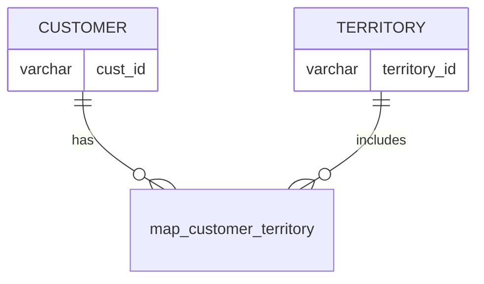

# Documentation for Table: dbo.map_customer_territory

## Overview
The `dbo.map_customer_territory` table is designed to associate customers with specific territories. This mapping likely serves the purpose of organizing customer data based on geographical or operational regions, which can be crucial for sales, marketing, and service delivery strategies. By linking customers to territories, businesses can better manage resources, tailor services, and analyze performance across different regions.

## Columns

| Name          | Type    | Nullable | Default | Description                          |
|---------------|---------|----------|---------|--------------------------------------|
| cust_id       | varchar | Yes      | None    | Identifier for the customer.        |
| territory_id  | varchar | Yes      | None    | Identifier for the territory.       |

## Keys & Relationships
- **Primary Keys**: None defined.
- **Foreign Keys**: None defined.

## Indexes
- No indexes are defined for this table. Adding indexes on `cust_id` and `territory_id` could improve query performance for lookups and joins involving these columns.

## Sample Data

| cust_id | territory_id |
|---------|---------------|
| C273    | T3            |
| C274    | T3            |
| C275    | T1            |

## Data Volume
The `dbo.map_customer_territory` table contains approximately 15 rows. This volume suggests that the table is relatively small, which may facilitate quick queries and updates. However, as the business grows, monitoring the volume and performance will be essential.

## Data Quality Red Flags
- Both `cust_id` and `territory_id` columns are nullable, which raises concerns about data integrity. If these fields are critical for business operations, it may be advisable to enforce non-null constraints.
- There are no primary or foreign keys defined, which could lead to orphaned records or inconsistencies in data relationships.
- The absence of indexes may hinder performance as the dataset grows, especially for queries that filter or join on these columns.