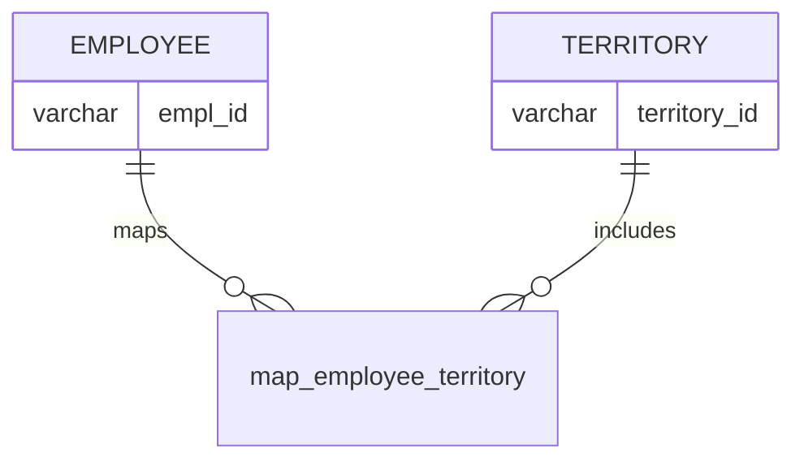

# Documentation for Table: dbo.map_employee_territory

## Overview
The `dbo.map_employee_territory` table is designed to establish a mapping between employees and their respective territories. This table likely serves a business purpose of managing sales territories or geographical areas assigned to employees, which can be crucial for sales performance tracking, resource allocation, and territory management.

## Columns

| Name          | Type    | Nullable | Default | Description                          |
|---------------|---------|----------|---------|--------------------------------------|
| empl_id      | varchar | Yes      | NULL    | Identifier for the employee.         |
| territory_id  | varchar | Yes      | NULL    | Identifier for the territory.        |

## Keys & Relationships
- **Primary Keys**: None defined.
- **Foreign Keys**: None defined.

## Indexes
No indexes are defined for this table. Adding indexes on `empl_id` and `territory_id` could improve query performance for lookups based on these columns.

## Sample Data

| empl_id | territory_id |
|---------|---------------|
| E849    | T3            |
| E850    | T3            |
| E851    | T3            |

## Data Volume
The table currently contains approximately **9 rows**. This volume is relatively small, which may imply that the table is either newly created, underutilized, or that the business has a limited number of employees and territories at this time.

## Data Quality Red Flags
- Both columns (`empl_id` and `territory_id`) are nullable, which may lead to incomplete records if not properly managed.
- There are no primary or foreign keys defined, which could lead to data integrity issues.
- The lack of indexes may hinder performance for queries that involve searching or filtering based on `empl_id` or `territory_id`.